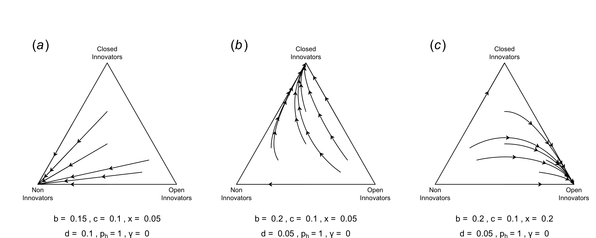
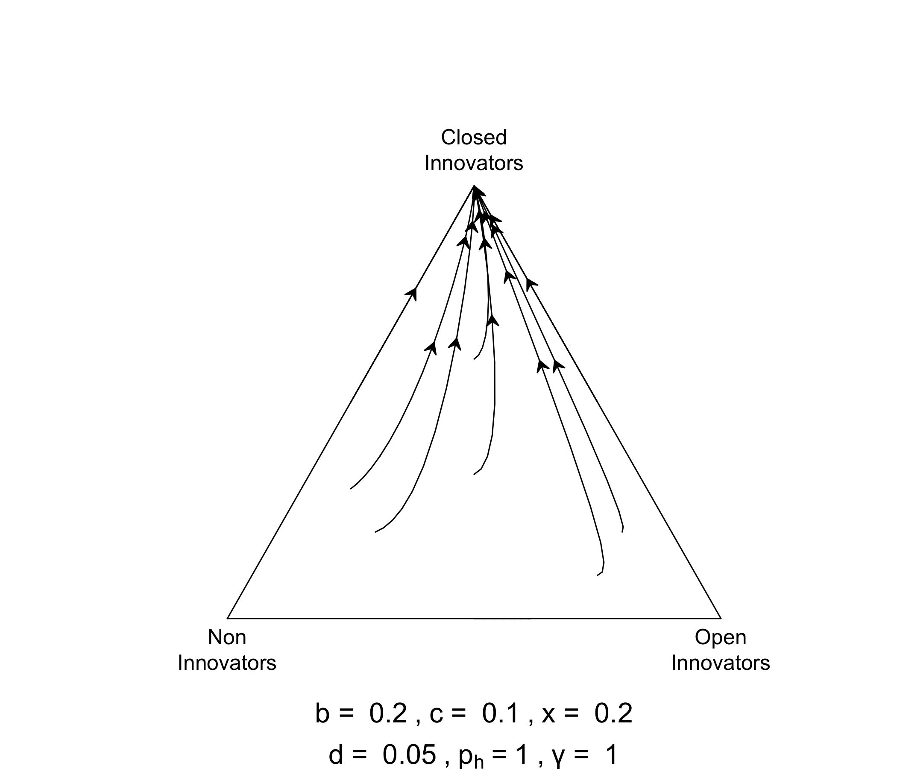
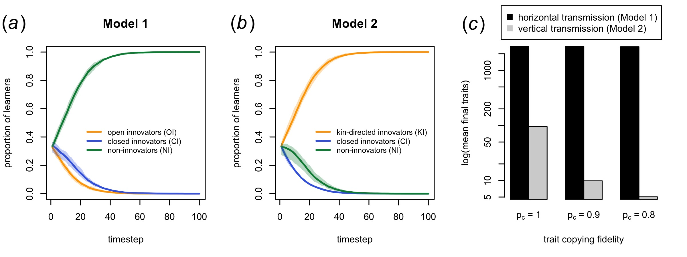
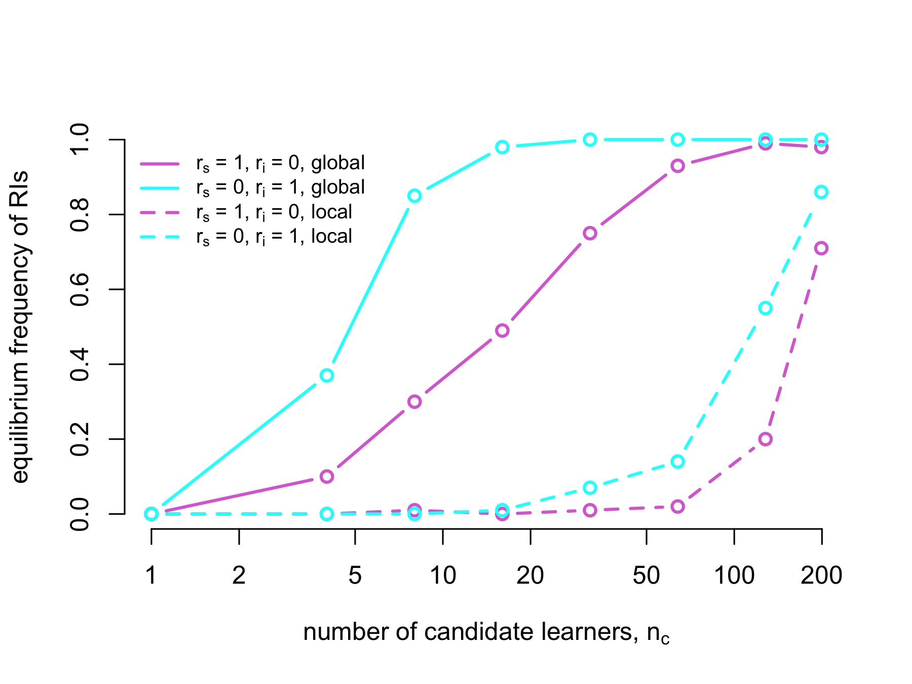
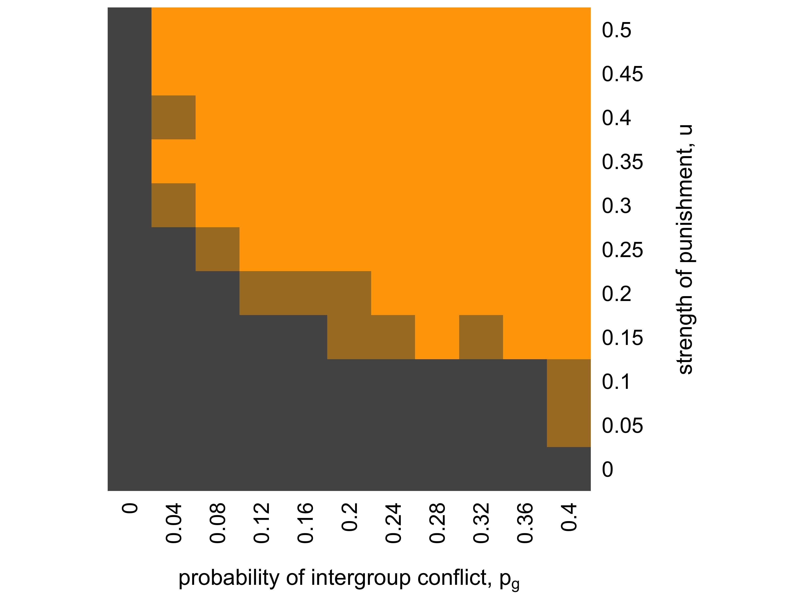

```{r settings, echo=FALSE, results = 'hide'}

eval_chunks <- FALSE

```

\newpage

# Abstract

Cumulative cultural evolution, where populations accumulate ever-improving knowledge, technologies and social customs, is arguably a unique feature of human sociality and responsible for our species’ ecological dominance of the planet. However, at the heart of cumulative cultural evolution is a cooperative dilemma. Assuming asocial learning is more costly than social learning, social learners can act as 'information free-riders' by copying innovations from asocial learners without paying the cost. This cost asymmetry will reduce innovation, inhibiting cumulative culture. Innovators might respond by protecting their knowledge and keeping the benefits to themselves – 'information hoarding' - but then others cannot build on their discoveries and again cumulative culture is inhibited. Here we formally model information free-riding and information hoarding within a cumulative cultural evolution framework using both analytical and agent-based models. Model 1 identifies the restrictive conditions under which information sharing can evolve in the face of information free-riding and hoarding. Models 2-4 then show how three mechanisms known to favour cooperation in non-informational contexts - kin selection, reputation-based partner choice and cultural group selection – can also solve the informational cooperative dilemma and facilitate cumulative cultural evolution, each with distinct signatures potentially detectable in historical, ethnographic and other empirical data.

**Keywords:** cooperation; cultural evolution; cumulative culture; innovation; social learning.

\newpage

# Introduction

Cumulative cultural evolution (CCE), where populations accumulate ever-improving knowledge, technologies and social customs, is arguably a unique feature of human sociality and responsible for our species’ ecological dominance of the planet [@henrich_secret_2015; @hill_emergence_2009; @tomasello_cultural_1999]. However, it is often overlooked that at the heart of CCE lies a cooperative dilemma. CCE requires both asocial learning (aka ‘individual learning’ or ‘innovation’) to create new knowledge, and social learning (aka ‘cultural transmission’ or 'cultural learning') to preserve and accumulate knowledge across generations [@mesoudi_what_2018]. Asocial learning is assumed to be more costly than social learning; it takes more time and effort to invent something new than copy it from someone else. This cost asymmetry can generate an informational tragedy of the commons [@hess_understanding_2011]. If innovators freely share their knowledge, then social learners can become 'information free-riders' by copying beneficial knowledge from innovators without bearing the costs of innovation. All else being equal, social learners will therefore outperform and replace all innovators. However, if everyone copies, then no-one is innovating, and CCE stops. Innovators might respond by protecting their knowledge and keeping the benefits to themselves – 'information hoarding' – although then others cannot build on their discoveries, and again CCE stops.

While humans have clearly to some extent solved this cooperative dilemma given that we exhibit CCE, a glance through history and across societies illustrates how pervasive and challenging information free-riding and information hoarding have been. Amongst West Papuan hunter-gatherers, expert male adze-makers transmit their skills exclusively to their sons or nephews via apprenticeships [@stout_skill_2002]. In medieval Venice, expert glassmakers were legally prohibited from leaving the city to prevent their skills spreading to rival states [@macfarlane_glass_2002]. In such cases, while specific actors benefit (adze-makers’ kin; the Venetian Republic), overall CCE is inhibited due to the reduced pool of innovators [@henrich_demography_2004; @derex_cumulative_2020].

Sometimes, however, widespread information-sharing emerges. Mokyr @mokyr_culture_2016 attributes the exponential accumulation of knowledge during the 17th–18th century Enlightenment to a ‘Republic of Letters’, a network of innovators such as Francis Bacon and Isaac Newton who openly shared ideas, data and methods. Mokyr attributes this to a process of ‘competitive patronage’, where powerful families or governments protected and rewarded innovators in exchange for reputational benefits. The recent ‘open science’ movement also represents a shift from scientists hoarding information for their own benefit to the open release of data and methods, aiding the identification of replicable results that can be more reliably built upon by others [@open_science_collaboration_estimating_2015]. Patent and copyright systems provide financial benefits to innovators to offset the costs of innovation [@nordhaus_invention_1969], although there is little consensus on their effectiveness [@budish_patents_2016], and practices such as patent thicketing or patent hoarding can block innovation, illustrating the fragility of information sharing.

Our aim here is to formally model information free-riding and information hoarding in a CCE context, to (i) explore when and why these phenomena inhibit CCE, and (ii) whether solutions to free-riding from the evolution of cooperation literature [@apicella_evolution_2019], originally designed for material cooperative dilemmas, also apply to informational cooperative dilemmas. Formal models can serve to clarify verbal arguments and historical case studies such as those of Mokyr @mokyr_culture_2016, highlighting often hidden underlying assumptions, and generating unexpected insights or predictions that are not apparent to the unaided mind [@smaldino_models_2016].

While previous theoretical and empirical studies have touched on the cooperative dilemma at the heart of CCE, none have directly addressed it, nor fully examined potential solutions to it. Rogers @rogers_does_1988 modelled the evolution of social learning as a producer-scrounger dilemma where innovators generate knowledge at higher cost than social learners can copy that knowledge. This generates a dilemma where, assuming constant environments, social learners entirely replace innovators because they bear lower costs and gain equal benefits. When environments change, a stable equilibrium exists between social learners and innovators due to the added advantage to innovators of discovering newly adaptive knowledge when previous knowledge becomes out-dated. In this model and its extensions [@enquist_critical_2007; @rendell_rogers_2010; @kameda_does_2003], social learning is a form of information free-riding. However, these models are not directly relevant to the context described above. Rogers' model does not allow the accumulation of knowledge, only alternation between one of two behaviours. Environmental change renders all existing knowledge useless, again preventing CCE. Furthermore, innovators have no control over whether others can copy them, thus excluding the possibility of information hoarding, nor solutions to the cooperative dilemma.

One study that incorporated both CCE and information hoarding modelled the accumulation of technology in a producer-scrounger game, with a parameter controlling the excludability of the technology produced by innovators [@lehmann_coevolution_2009]. Generally, social learners facilitated CCE by acquiring multiple beneficial technologies from different innovators and passing them all to the next generation. Excludability acted against this: when innovators could prevent social learners copying them, fewer social learners persisted, inhibiting CCE. While this model demonstrates the negative consequence of information hoarding for CCE, it does not model cooperative solutions to information hoarding. 

A more recent model allowed innovators to either teach, i.e. improve the chances of social learning, or mask, i.e. decrease the chances of social learning, equivalent to information hoarding [@turner_joint_2023]. This and other models of the evolution of teaching [@fogarty_evolution_2011] find that teaching evolves due to kin selection, as both genes for teaching and adaptive information are transmitted together from parent to offspring. Yet these models are designed to explore the evolution of teaching across different species rather than the emergence of information sharing within human CCE, and make assumptions (e.g. that teaching and masking are genetically transmitted) that are inconsistent with the diversity and sporadic emergence and loss of information sharing through human history.

The following models build up in complexity to first formally analyse the informational dilemma at the heart of CCE (Model 1) before exploring how kin selection (Model 2), partner choice (Model 3) and cultural group selection (Model 4) might solve this dilemma and facilitate CCE. Figure S1 presents a schematic of the four models.


# Model 1: The dilemma

The aim of Model 1 is to formalise the informational public goods dilemma described above. This is intended as a clarification of the logic using many simplifying assumptions, not a realistic simulation of specific historical processes. Model 1a is an analytic population-level model. Model 1b introduces an agent-based version of Model 1a with explicit agents, traits and transmission events which recreates and confirms the findings of Model 1a and serves as a basis for Models 2-4.

Model 1a formalises two processes: information free-riding and information hoarding. Assume three types of individual. Open Innovators innovate at cost $c$ to generate a cultural trait that yields a benefit $b$ (see Table S1 for a full list of parameters). Open Innovators then freely and unconditionally share their trait with others. They receive a benefit $x$ for sharing their trait, via a mechanism which for now remains unspecified, but might include enhanced reputation or group success. Subsequent models replace $x$ with explicit mechanisms, but for now we leave it as a placeholder. Non-Innovators never innovate, are content to let others undergo costly innovation, and benefit from others' (open) innovation. They can be seen as information free-riders. Closed Innovators innovate at cost $c$ with benefit $b$, and then bear an additional cost $d$ to hoard their trait from others. With probability $p_h$ this hoarding is successful, otherwise the innovation is released to the community just like those of Open Innovators. If their innovation is released, they also get the benefits of sharing $x$. Closed Innovators can be seen as information hoarders. Our guiding question is under what conditions do Open Innovators displace Closed Innovators and Non-Innovators.

Assume the number of Open, Closed and Non-Innovators in the population are $X$, $Y$ and $Z$ respectively. The payoff to an Open Innovator, $W(OI)$, is then:

$$W(OI) = w_0 + bX + bY(1-p_h) + x - c  \hspace{30 mm}(1)$$

In addition to baseline payoff $w_0$, each Open Innovator receives a payoff $b$ from each of the innovations generated by the $X$ Open Innovators in the population (including themselves), a payoff $b$ from the $Y(1-p_h)$ Closed Innovators who unsuccessfully protect their innovation such that it becomes openly known, a benefit $x$ for releasing their innovation, and they bear a cost of innovation $c$. 

The payoff to a Closed Innovator, $W(CI)$, is:

$$W(CI) = w_0 + bX + bY(1-p_h) + bp_h + x(1-p_h) - c - d  \hspace{30 mm}(2)$$

Each Closed Innovator receives the same benefits as Open Innovators from the open knowledge generated by Open Innovators and unsuccessful Closed Innovators, $bX + bY(1 - p_h)$. Closed Innovators also receive, with probability $p_h$, another benefit $b$ from their successfully protected innovation, and with probability $1 - p_h$ a benefit $x$ from sharing their unsuccessfully protected innovation. Finally, each Closed Innovator bears a cost of innovation $c$ and a cost of attempting to protect their knowledge $d$.

The payoff to a Non-Innovator, $W(NI)$, is:

$$W(NI) = w_0 + bX + bY(1-p_h)  \hspace{30 mm}(3)$$

Non-Innovators pay no costs of innovating, and receive the benefits of open innovation from Open Innovators and unsuccessful Closed Innovators 

Note that in this formulation, innovation is a perfectly *non-rival* good via its benefit $b$. Every Open Innovator and unsuccessful Closed Innovator generates a payoff $b$ which is received by (not divided amongst) every individual in the population. This captures the notion that knowledge, unlike material goods, can be shared via cultural transmission without loss; one person can transmit knowledge to another without themselves losing that knowledge [@romer_endogenous_1990]. Innovation is *excludable* for Closed Innovators via parameter $p_h$: with probability $p_h$, Closed Innovators generate private knowledge, and with probability $1 - p_h$ it is non-excludable. For Open Innovators, innovation is always non-excludable.

Open Innovators can invade Non-Innovators when $x > c$. This is when the benefits to Open Innovators of releasing their innovation outweigh the cost of producing that innovation. Note that $b$ is not present in this inequality. It does not matter how big the benefit is of the innovation, because both Open Innovators and Non-Innovators receive that benefit.

Closed Innovators can invade Non-Innovators when $bp_h + x(1 - p_h) > c + d$. This is when the benefit to Closed Innovators of private innovation, $bp_h$, plus the reputational benefit of unsuccessfully protected innovation, $x(1 - p_h)$, outweigh the costs to Closed Innovators of innovation and of protecting their innovation. Here the benefit of innovation, $b$, does matter, because when Closed Innovators are successful then only they receive their private benefit.

Open Innovators can invade Closed Innovators when $d > p_h(b-x)$. This is fulfilled when $d$ is large (imposing high costs on Closed Innovators), when $p_h$ is small (low probability of Closed Innovators generating private knowledge not available to Open Innovators) and when $x$ is large relative to $b$ (because Open Innovators benefit uniquely from $x$ and not $b$). When $x > b$ then, assuming that $d > 0$, Open Innovators will always outperform Closed Innovators. Note that $c$ is not present in this inequality, as both Open Innovators and Closed Innovators pay innovation costs.

Consider how to get to a population of Open Innovators from a mix of Non-Innovators and Closed Innovators. Consider first a situation when $p_h = 1$, i.e. Closed Innovators are always successful in protecting their knowledge. This is perhaps due to poor communication and limited social networks. This means that Open Innovators will do better than Non-Innovators when $x > c$ and better than Closed Innovators when $x > b - d$. Only when both of these conditions are met will Open Innovators spread. Collectively, then, for Open Innovators to spread, $x$ and/or $d$ need to increase relative to $c$ and/or $b$ (figure 1). 

```{r model 1a baryplot code, echo=FALSE, results = 'hide'}

# # code to install package baryplot
# options(repos=c(getOption("repos"),baryplot="http://xcelab.net/R"))
# install.packages("baryplot",type="source")

library(baryplot)

# modify bary.plot and bary.simplot to allow b to increase (see below)

"bary.plotsim" <-
  function( sx , sy , b , arrow=FALSE , withcol=FALSE, thegame=bary.game.hdr, ... ) {
    ## takes a starting point and plots a simulation trajectory
    ## arrow=TRUE plots arrows to show direction of path
    x <- sx;
    y <- sy;
    if(withcol) maxv <- bary.maxvelocity(thegame=thegame, ...);
    dist <- 1;
    arrowcount <- 0;
    while(dist > 0.00001) {
      deltaxy <- bary.sim( x , y , b, thegame=thegame , ... );  # starting coords passed to bary.sim
      newpt <- c( deltaxy[1] + x, deltaxy[2] + y );
      b <- deltaxy[4];
      origin <- c( x, y );
      arrowflag <- FALSE;
      if( arrowcount > 0.25 && arrow ) {
        arrowcount <- 0;
        arrowflag <- TRUE;
      }
      dist <- sqrt( deltaxy[1]^2 + deltaxy[2]^2 );
      acolor <- "black";
      if(withcol) acolor <- bary.makecolor(dist/maxv);
      bary.line( origin, newpt, arrow=arrowflag, col=acolor );
      arrowcount <- arrowcount + dist;
      x <- newpt[1];
      y <- newpt[2];
    }
    c( c(sx,sy), c(x, y) );
  }

"bary.sim" <-
  function( startx, starty, b, thegame=bary.game.hdr, ... ) {
    p <- startx;
    q <- starty;
    ## call the game function to get fitness values
    w <- thegame( p, q, 1-p-q , b , ... );
    wbar <- p*w[1] + q*w[2] + (1-p-q)*w[3];
    dp <- p*w[1]/wbar - p;
    dq <- q*w[2]/wbar - q;
    dr <- (1-p-q)*w[3]/wbar - (1-p-q);
    b <- w[4];
    c(dp,dq,dr,b);
  }

model1a_baryplot <- function (b, c, x, d, p_h, w_0, gam = 0, panel_label = "") {
  
  # for convenience, exclude the terms common to all agents 
  # (conceptually, they can be integrated into w_0, and make no difference to the dynamics)
  
  bary.model1a <- function(X, Y, Z, b) {
    b <- b + gam * (b*X + (1-p_h) * Y * b)
    w1 <- w_0 + b*X + (1-p_h) * Y * b + x - c
    w2 <- w_0 + b*X + (1-p_h) * Y * b + b*p_h + (1-p_h)*x - c - d
    w3 <- w_0 + b*X + (1-p_h) * Y * b
    c(w1,w2,w3,b)
  }
  
  bary.init()
  #bary.labels("OI", "CI", "NI")
  text( 0, 0, "Non\nInnovators", xpd=NA, adj=c(0.5,1.25) )
  text( 1, 0, "Open\nInnovators", xpd=NA, adj=c(0.5,1.25) )
  text( 0.5, 0.95, "Closed\nInnovators", xpd=NA, adj=c(0.5,0.5) )
  title(sub = bquote(atop("b = " ~ .(b) ~ "," ~ "c = " ~ .(c) ~ "," ~ "x = " ~ .(x),"d = " ~ .(d) ~ "," ~ p[h] ~ "=" ~ .(p_h) ~ "," ~ "γ = " ~ .(gam))), cex.sub = 1.3, line = 4.3)
  bary.plotsim(1/3, 1/3, b, arrow=TRUE, thegame = bary.model1a)
  bary.plotsim(0.5, 0.5, b, arrow=TRUE, thegame = bary.model1a)
  bary.plotsim(0.0, 0.5, b, arrow=TRUE, thegame = bary.model1a)
  bary.plotsim(0.5, 0.0, b, arrow=TRUE, thegame = bary.model1a)
  bary.plotsim(0.2, 0.6, b, arrow=TRUE, thegame = bary.model1a)
  bary.plotsim(0.7, 0.2, b, arrow=TRUE, thegame = bary.model1a)
  bary.plotsim(0.7, 0.1, b, arrow=TRUE, thegame = bary.model1a)
  bary.plotsim(0.2, 0.2, b, arrow=TRUE, thegame = bary.model1a)
  bary.plotsim(0.1, 0.3, b, arrow=TRUE, thegame = bary.model1a)
  text(0.02, 1, labels = panel_label, cex = 2)
  
}

```

```{r make figure 1, echo=FALSE, results = 'hide', eval = eval_chunks}

# create folder called figures if it doesn't already exist
if (!dir.exists("figures")) {dir.create("figures")}

# export to file first
png("figures/fig1.png", height = 4, width = 10, units = "in", res = 300)

par(mfrow=c(1,3))

# condition that favours NI: x<c and b<c+d
model1a_baryplot(b = 0.15, c = 0.1, x = 0.05, d = 0.1, p_h = 1, w_0 = 1, 
                panel_label = substitute(paste("(",italic("a"),")")))#"(a)")

# condition that favours CI: b>c+d and x<b-d - reduce d, increase b
model1a_baryplot(b = 0.2, c = 0.1, x = 0.05, d = 0.05, p_h = 1, w_0 = 1, 
                panel_label = substitute(paste("(",italic("b"),")")))#"(b)")

# condition that favours OI: x>c and x>b-d - increase x
model1a_baryplot(b = 0.2, c = 0.1, x = 0.2, d = 0.05, p_h = 1, w_0 = 1,
                panel_label = substitute(paste("(",italic("c"),")")))#"(c)")

dev.off()

```

```{r show fig 1, out.width="100%", echo=FALSE}



```

**Figure 1.** Three conditions in which Non Innovators, Closed Innovators and Open Innovators are respectively favoured. (*a*) $x < c$ and $b < c + d$ so Non-Innovators spread at the expense of Open Innovators and Closed Innovators. (*b*) $b$ is increased and $d$ is decreased to now favor Closed Innovators. (*c*) $x$ is increased such that $x > c$ and $x > b-d$, favoring Open Innovators. Plots created using a modified version of package *baryplot* [@mcelreath_baryplot_2012].

&nbsp;

Note the apparent paradox here related to $b$. Open Innovators are more likely to emerge if the benefit from innovation $b$ is small. Yet CCE by definition surely *increases* $b$ in absolute terms, as technology becomes more effective and knowledge more accurate. So the consequence of open innovation - larger benefits of innovation - paradoxically make it harder for open innovation to emerge.

Consider now the case when $p_h < 1$, i.e. when Closed Innovators sometimes fail to protect their knowledge. This might be due to inventions or institutions such as the printing press, postal services, cheaper transportation or the internet making it harder to keep innovations secret. Reducing $p_h$ does not affect whether Open Innovators outcompete Non-Innovators, which remains when $x > c$. Benefits of sharing still need to outweigh the costs of innovation. However, it does reduce the parameter space within which Closed Innovators can outcompete Open Innovators, assuming $x > c$. At the extreme when $p_h = 0$, Open Innovators will replace Closed Innovators whenever $d > 0$ (figure S2). This confirms the notion that making it harder to protect or conceal knowledge favours open innovation.

Finally, we implement a crude form of CCE by assuming that the benefits to innovation, $b$, increase with accumulating knowledge. A steel axe is more effective and durable than a stone axe, but only appeared after the accumulation of prior axe manufacturing and steelworking knowledge. Quantum physics is more accurate than Newtonian physics, but only appeared after the latter was established.

Accumulated knowledge must be openly available in order to accumulate, otherwise it dies with the innovator. We therefore assume that every timestep the parameter $b$ increases by an amount $\gamma (bX + bY(1-p_h))$. Here $\gamma$ is a constant controlling the extent to which $b$ increases, and the term in brackets is the benefit accrued from open knowledge generated by Open Innovators and unsuccessful Closed Innovators. When $\gamma = 0$ we retrieve the results shown in figure 1; as $\gamma$ increases, so does $b$ in each timestep.

Figure 2 shows the same parameter values as figure 1*c* where Open Innovators were previously favoured, but with $\gamma = 1$. Now Closed Innovators are favoured. This is because increasing $b$ favours Closed Innovators by increasing their benefit from private innovation ($bp_h$). The increased benefits generated by Open Innovators and unsuccessful Closed Innovators is shared by all agents and therefore does not affect the dynamics.


```{r make fig 2, echo=FALSE, results = 'hide', eval = eval_chunks}

png("figures/fig2.png", height = 6, width = 7, units = "in", res = 300)

par(mfrow=c(1,1))

model1a_baryplot(b = 0.2, c = 0.1, x = 0.2, d = 0.05, p_h = 1, w_0 = 1, gam = 1) # gamma=1, benefits accumulate

dev.off()

```

```{r show fig 2, out.width="60%", fig.align='center', echo=FALSE}



```

**Figure 2.** Allowing benefits from innovation to accumulate by setting $\gamma = 1$ favours Closed Innovators where Open Innovators would otherwise be favoured (as in figure 1*c*).

&nbsp;

Model 1b replicates and extends Model 1a to incorporate explicit agents, interactions and traits. This added complexity and need to explicitly model social interactions favours an agent-based modelling approach [@acerbi_individual-based_2022; @smaldino_modeling_2023]. Model 1b assumes $N$ agents each of whom can learn any number of $L$ traits. Traits are represented as 'bit strings', sequences of $L$ ones and zeroes where a 1 in position $l$ indicates that the $l$th trait has been learned and a 0 indicates a lack of knowledge of the trait. For example, $00110$ is a set of $L = 5$ traits of which this agent only knows the third and fourth. Each learned trait gives the agent a benefit $b$ each timestep; this agent would receive $2b$ from their two learned traits.

As in Model 1a, agents are Open Innovators, Closed Innovators or Non-Innovators. In each of $t_{max}$ timesteps, each Open Innovator and Closed Innovator engages in innovation by picking one of its $L$ traits at random and, if that trait is 0, switching it to 1 with probability $p_i$. Innovation costs $c$ whether successful or not. Following innovation, there is sharing/copying. As before, Closed Innovators successfully hoard their traits with probability $p_h$. Each agent copies each trait known by at least one non-hoarding agent (all Open Innovators, all Non-Innovators, and unsuccessful Closed Innovators) with probability $p_c$ per trait. When $p_c = 1$, each agent acquires all the traits known by all non-hoarding agents in the population. This extreme case matches Model 1a, with $p_c < 1$ the more realistic case when only some innovations are acquired due to time constraints or copying error. As before, Open Innovators and unsuccessfully-hoarding Closed Innovators who innovated on that timestep receive a benefit $x$ for openly releasing their innovation. Closed Innovators pay a hoarding cost $d$ whether hoarding is successful or unsuccessful. However, Closed Innovators who fail to innovate (because $p_i < 1$) do not pay the cost $d$ as they have nothing to hoard.

After fitnesses are calculated, there is payoff-biased copying of strategies (Open Innovation, Closed Innovation or Non-Innovation). Each agent picks another agent in the population at random. If the chosen agent has higher fitness than the focal agent, then the focal agent adopts the strategy of the chosen agent with probability $p_s$. Then there is agent turnover. With probability $p_d$, each agent 'dies' and is replaced with a naive, unknowledgeable agent whose traits are all zero. The new agent keeps the same strategy as its 'parent'. The parameter $p_d$ therefore controls how much timesteps overlap. When $p_d = 1$, all agents die each timestep and are replaced with unknowledgeable agents, recreating Model 1a. When $p_d = 0$, agents live forever, or at least until $t_{max}$ timesteps. This resembles a fixed population of agents engaging in repeated cycles of innovation and copying, allowing the accumulation of learned traits over time. 

Finally, it is unrealistic to assume that if a population learns all $L$ possible traits then cultural evolution stops. Consequently we assume that when the mean proportion of traits known across all agents in the population reaches 0.9, then a new set of $L$ unknown traits are added to the set of possible traits. This can be seen as the opening up of a new space of possibilities once knowledge in one domain has reached a certain point. For example, automobile tyre designs increased rapidly in diversity and effectiveness following the invention of the automobile in the late 19th century before stabilising and converging on a single design containing a specific set of innovations [@klepper_making_2000]. This generates patterns of punctuated equilibria with rapid increases in cultural knowledge followed by stasis, then rapid increases again [@valverde_punctuated_2015; @derex_human_2021]. This makes Model 1b resemble genuine sequential cumulative cultural evolution, rather than the crude implementation in Model 1a.

```{r model 1b and plot_freq code, echo=FALSE, results = 'hide'}

model1b <- function(N = 1000, t_max = 200, L = 1000,
                    x_0 = 1/3, y_0 = 1/3, 
                    p_c = 1, p_i = 1, p_h = 1, p_s = 0.1, p_d = 1,
                    b = 0.15, c = 0.1, d = 0.1, x = 0.05, w = 0,
                    r_max = 1, progress = FALSE) {
  
  # output dataframe
  output <- data.frame(r = rep(1:r_max, each = t_max),
                       t = rep(1:t_max, times = r_max), 
                       OIfreq = rep(NA, t_max*r_max),
                       CIfreq = rep(NA, t_max*r_max),
                       NIfreq = rep(NA, t_max*r_max),
                       OIfitness = rep(NA, t_max*r_max),
                       CIfitness = rep(NA, t_max*r_max),
                       NIfitness = rep(NA, t_max*r_max),
                       mean_traits_prop = rep(NA, t_max*r_max),
                       mean_traits_abs = rep(NA, t_max*r_max),
                       L_added = rep(0, t_max*r_max))
  
  # r independent runs
  for (r in 1:r_max) {
    
    # agent dataframe
    agent <- data.frame(strategy = sample(c("OI", "CI", "NI"), 
                                          N, 
                                          replace = TRUE, 
                                          prob = c(x_0, y_0, 1-x_0-y_0)),
                        hoard = rep(0, N),  # 0=no hoarding, 1=CIs who hoard
                        innovated = rep(0, N),  #0=didn't innovate, 1=did innovate
                        fitness = rep(NA, N))
  
    # if 1st run, record initial L, in case of later increases
    if (r == 1) L_initial <- L
    # if 2nd+ run, reset to original user-defined L
    if (r > 1) L <- L_initial
    
    # separate matrix for traits, strings of length L
    traits <- matrix(0, nrow = N, ncol = L)
  
    # start timestep loop
    for (t in 1:t_max) {
    
      # 1. innovation for OIs and CIs
      # each OI and CI agent picks a bit at random and if it's zero flips it to 1 with prob p_i
    
      # reset innovated marker
      agent$innovated <- 0
    
      selected_trait <- sample(1:L, N, replace = TRUE)
      probs <- runif(N) < p_i
    
      for (i in 1:N) {
      
        if (agent$strategy[i] != "NI") {
        
          if (!traits[i,selected_trait[i]] & probs[i]) {
          
            traits[i,selected_trait[i]] <- 1  # innovate
            agent$innovated[i] <- 1  # record innovation
          
          }
        
        }
      
      }
    
    
      # 2. information hoarding for CIs given p_h
      # CI agents successfully hoard their innovation with prob p_h. OIs and NIs never hoard
    
      agent$hoard[agent$strategy == "CI"] <- runif(sum(agent$strategy == "CI")) < p_h
      agent$hoard[agent$strategy != "CI"] <- 0
    
    
      # 3. social learning
      # each bit known by all non-hoarding agents is copied by all agents with prob p_c per trait
      # (skip if there are no non-hoarding agents)
    
      if (sum(agent$hoard) < N) {
      
        if (sum(agent$hoard) == N-1) {
          common_traits <- traits[!agent$hoard,]  # if only one non-hoarder
        } else {
          common_traits <- as.numeric(colSums(traits[!agent$hoard,]) > 0)  # more than one
        }
      
        for (i in 1:N) {
        
          probs <- runif(L) < p_c
          traits[i,common_traits & probs] <- 1
        
        }
      
      }
    
    
      # 4. calculate fitnesses
    
      # set fitness to baseline
      agent$fitness <- w
    
      # all agents get their trait level*b
      agent$fitness <- agent$fitness + b*rowSums(traits)
    
      # all OIs and CIs get fitness cost of innovation c
      agent$fitness[agent$strategy != "NI"] <- agent$fitness[agent$strategy != "NI"] - c
    
      # all CIs get cost of attempting to hoard information d if they innovated
      agent$fitness[agent$strategy == "CI" & agent$innovated == 1] <- agent$fitness[agent$strategy == "CI" & agent$innovated == 1] - d
    
      # all OIs and unsuccessful CIs get fitness benefit of releasing x if they innovated
      agent$fitness[agent$strategy == "OI" & agent$innovated == 1] <- agent$fitness[agent$strategy == "OI" & agent$innovated == 1] + x
      agent$fitness[agent$strategy == "CI" & agent$hoard == 0 & agent$innovated == 1] <- agent$fitness[agent$strategy == "CI" & agent$hoard == 0 & agent$innovated == 1] + x
    
    
      # 5. store pre-reproduction frequencies and fitnesses
    
      output$OIfreq[output$r == r & output$t == t] <- sum(agent$strategy == "OI") / N
      output$CIfreq[output$r == r & output$t == t] <- sum(agent$strategy == "CI") / N
      output$NIfreq[output$r == r & output$t == t] <- sum(agent$strategy == "NI") / N
      output$OIfitness[output$r == r & output$t == t] <- mean(agent$fitness[agent$strategy == "OI"])
      output$CIfitness[output$r == r & output$t == t] <- mean(agent$fitness[agent$strategy == "CI"])
      output$NIfitness[output$r == r & output$t == t] <- mean(agent$fitness[agent$strategy == "NI"])
      output$mean_traits_prop[output$r == r & output$t == t] <- mean(rowSums(traits)) / L
      output$mean_traits_abs[output$r == r & output$t == t] <- mean(rowSums(traits))
    
    
      # 6. payoff-biased copying of strategies
      # agents pick another agent at random and if they have higher fitness, and with prob p_s, copy their strategy
    
      demonstrators <- sample(1:N, replace = TRUE)
      probs <- runif(N) < p_s
    
      agent$strategy[agent$fitness < agent$fitness[demonstrators] & probs] <- agent$strategy[demonstrators][agent$fitness < agent$fitness[demonstrators] & probs]
    
    
      # 7. agent replacement (traits reset) with probability p_d
      probs <- runif(N) < p_d
      traits[probs,] <- 0
    
    
      # 8. if mean_traits_prop is 90% or above, add another L_initial undiscovered traits onto L
      if (output$mean_traits_prop[output$r == r & output$t == t] > 0.9) {

        traits <- cbind(traits, matrix(0, nrow = N, ncol = L_initial))
        L <- L + L_initial
        output$L_added[output$r == r & output$t == t] <- 1

      }
    
      # optional progress message
      if (progress == TRUE) {
        if (t == 1) cat("run", r, "of", r_max, fill=T)
        cat("t =", t, "of", t_max, fill=T)
      }
    
    }
    
  }
  
  output
  
} 

plot_freq <- function(output, panel_label = "", main_title = "", 
                      main_title_size = 0.9, draw_legend = T) {
  
  # retrieve parameters from output
  r_max <- max(output$r)
  t_max <- max(output$t)
  
  # get mean, max and min
  d <- matrix(NA, nrow = t_max, ncol = 9)
  colnames(d) <- c("OImean","CImean","NImean",
                   "OImax","CImax","NImax",
                   "OImin","CImin","NImin")
  
  for (t in 1:t_max) {
    d[t,"OImean"] <- mean(output$OIfreq[output$t == t])
    d[t,"CImean"] <- mean(output$CIfreq[output$t == t])
    d[t,"NImean"] <- mean(output$NIfreq[output$t == t])
    d[t,"OImax"] <- max(output$OIfreq[output$t == t])
    d[t,"CImax"] <- max(output$CIfreq[output$t == t])
    d[t,"NImax"] <- max(output$NIfreq[output$t == t])
    d[t,"OImin"] <- min(output$OIfreq[output$t == t])
    d[t,"CImin"] <- min(output$CIfreq[output$t == t])
    d[t,"NImin"] <- min(output$NIfreq[output$t == t])
  }
  
  plot(d[,"OImean"],
       type = 'l',
       lwd = 2,
       col = "orange",
       ylim = c(0,1),
       ylab = "proportion of learners",
       xlab = "timestep")
  
  lines(d[,"CImean"],
        type = 'l',
        lwd = 2,
        col = "royalblue")
  
  lines(d[,"NImean"],
        type = 'l',
        lwd = 2,
        col = "springgreen4")
  
  # shaded range
  polygon(c(1:t_max, rev(1:t_max)), c(d[,"OImin"], rev(d[,"OImax"])),
          col = adjustcolor("orange", alpha.f = 0.3), lty = 0)
  polygon(c(1:t_max, rev(1:t_max)), c(d[,"CImin"], rev(d[,"CImax"])),
          col = adjustcolor("royalblue", alpha.f = 0.3), lty = 0)
  polygon(c(1:t_max, rev(1:t_max)), c(d[,"NImin"], rev(d[,"NImax"])),
          col = adjustcolor("springgreen4", alpha.f = 0.3), lty = 0)
  
  if (r_max == 1) {
    
    # plot mean trait level over time
    lines(output$mean_traits_prop,
          type = 'l',
          lwd = 2,
          col = "grey30")
  
    # horizontal dotted line at 1
    abline(h = 1, lty = 2)
  
    # vertical dotted lines when new L traits are added
    abline(v = which(output$L_added == 1), lty = 3)
  
    if (draw_legend == T) legend(x = nrow(output)/5, y = 0.5,
                                 legend = c("open innovators (OI)", 
                                          "closed innovators (CI)", 
                                           "non-innovators (NI)",
                                           "mean traits known"),
                                 col = c("orange", "royalblue", "springgreen4","grey30"),
                                 lty = 1, lwd = 2, bty = "n", cex = 0.8)
    
  } else {
    
    if (draw_legend == T) legend(x = t_max/5, y = 0.5,
                                 legend = c("open innovators (OI)", 
                                            "closed innovators (CI)", 
                                            "non-innovators (NI)"),
                                 col = c("orange", "royalblue", "springgreen4"),
                                 lty = 1, lwd = 2, bty = "n", cex = 0.8)
    
  }
  
  if (panel_label != "") text(-t_max*0.25, 1.2, labels = panel_label, cex = 2, xpd = NA)
  
  if (main_title != "") title(main = main_title, cex.main = main_title_size)
  
}

```

Model 1b replicated the findings of Model 1a with equivalent parameter values (figures S3-S5), supporting the conclusions drawn by the analytical model. We additionally find that reducing the probability of innovation $p_i$ favours Non-Innovators given that Open and Closed Innovators pay a cost for innovation that increasingly yields no benefits (figure S6). We also find that when the information dilemma is eliminated by making innovation easier than social learning ($p_c < p_i$), then Open Innovators do best, as expected (figure S6). Finally, Model 1b shows a clear link between scenarios in which parameter values favour open innovation and CCE (figure S7): more open innovation means more traits are accumulated, and when combined with overlapping timesteps ($p_d < 1$) generates open-ended CCE.


## Summary of Model 1

The aim of Model 1 was to formalise the informational dilemmas at the heart of CCE. Using both analytical and agent-based models, we showed two ways in which Open Innovators who freely share information can be exploited, resulting in the disruption of CCE. First, information free-riding occurs when Non-Innovators can copy cultural traits from Open Innovators without paying the cost of innovation, and when any benefits accrued to Open Innovators for information sharing fail to compensate for this (i.e. when $x < c$). The actual benefit gained from the innovation, $b$, does not matter here, given that both Open Innovators and Non-Innovators receive it. Second, and perhaps less commonly appreciated, information hoarding occurs when Closed Innovators can generate and hoard their own private knowledge, plus receive public knowledge from Open Innovators. Open Innovators only have public knowledge. Unless the benefits of information sharing to Open Innovators outweigh the benefits to Closed Innovators of private knowledge (i.e. when $x > b$, assuming non-overlapping timesteps), then Closed Innovators will displace Open Innovators. Interestingly, when cultural traits can accumulate, in Model 1a by increasing the benefit $b$ in proportion to openly released knowledge, and in Model 1b by making timesteps overlap such that traits are inherited across generations, then information sharing is even less likely. This is because private knowledge hoarded by Closed Innovators is increasingly beneficial, and increasingly likely to outweigh the benefits of information sharing. Finally, our agent-based Model 1b demonstrated a clear link between the presence of information sharing and CCE: when Open Innovators dominate, then cultural traits accumulate, and when combined with overlapping timesteps generates open-ended CCE. Overall, crucial to the emergence of CCE is the currently-unspecified benefits of openly releasing information, $x$. In Models 2-4 we replace this parameter with three mechanisms from the evolution of cooperation literature which endogenously direct benefits back to Open Innovators: kin selection (Model 2), partner choice (Model 3) and cultural group selection (Model 4).

# Model 2: Kin selection

A widespread solution to cooperative dilemmas in nature is kin selection [@hamilton_genetical_1964]. Individuals direct helping behaviour towards kin who share genes with the helper due to common ancestry. On average, relatives will share the genes underlying kin-directed cooperation, and so such genes will increase in frequency as a result of the cooperation. Kin selection explains the vast majority of cooperative behaviour in non-human species [@clutton-brock_cooperation_2009], as well as various forms of human cooperation [@kurzban_evolution_2015; @silk_adoption_1980; @daly_evolutionary_1988].

Here we do not model the evolution of cooperation via kin selection, which has been extensively modelled in evolutionary biology [@hamilton_genetical_1964; @marshall_social_2015]. We assume kin selection has already evolved in our species, and provides motivation to preferentially help genetic relatives. In the context of information sharing, individuals should preferentially share information with relatives. We focus on parent-to-offspring transmission (often labelled 'vertical cultural transmission': @cavalli-sforza_cultural_1981), given that parents will typically have greater knowledge than, and spend considerable time with, their children. This resembles the case of father-son adze making apprenticeships amongst West Papuans [@stout_skill_2002]. (Note however that there is extensive evidence of learning from non-parents across societies [@harris_where_1995; @aunger_life_2000; @henrich_nature_2011; @demps_social_2012; @lew-levy_who_2020], both obliquely from unrelated elders and horizontally from unrelated peers.) However, while kin selection may be one solution to the informational dilemma, it has downsides. Learning from just two parents - or one, in cases of sex-specific skills and knowledge - provides a far smaller pool of demonstrators and teachers than learning from any member of society. Fewer demonstrators means slower CCE [@henrich_demography_2004; @derex_cumulative_2020]. 

The aim of Model 2 is to formalise and test the notion that kin-directed information sharing can avoid exploitation by information free-riding and information hoarding, as well as its limitations in terms of fewer demonstrators. Model 2 is identical to Model 1b except for the social learning stage. We no longer assume social learning from all non-hoarders, i.e. horizontal cultural transmission, nor Open Innovators who indiscriminately share with all other agents. Instead, social learning takes the form of vertical transmission and occurs at the start of each timestep (except the first, when there are no parents from whom to learn). Open Innovators are replaced with Kin-directed Innovators who share traits exclusively with their offspring. Each agent produces one offspring, i.e. asexual reproduction. While humans are obviously not asexual reproducers, this might resemble sex-specific transmission of skills, as well as providing a simple test case. Parents transmit their strategies (Kin-directed Innovator, Closed Innovator or Non-Innovator) to their one offspring. This could be via either genetic or cultural inheritance. Non-hoarding agents (Kin-directed Innovators, Non-Innovators and unsuccessful Closed Innovators) also transmit each of their known cultural traits to that offspring with probability $p_c$ per trait. There is then innovation amongst Kin-directed Innovators and Closed Innovators, fitness calculations, and payoff-biased copying of strategies, all as in Model 1b. There is now no agent mortality (i.e. $p_d$ is absent) because all agents are assumed to die each timestep and are replaced with their offspring. Unlike Model 1, there are now no direct benefits of openness ($x = 0$) given that kin selection is explicitly modelled as a mechanism providing those benefits. Initially we assume copying and innovation are both errorless ($p_c = p_i = 1$) and hoarding always successful ($p_h = 1$). 

```{r model 2 and plotfreqKI code, echo=FALSE, results = 'hide'}

model2 <- function(N = 1000, t_max = 200, L = 1000,
                   x_0 = 1/3, y_0 = 1/3, 
                   p_c = 1, p_i = 1, p_h = 1, p_s = 0.1,
                   b = 0.15, c = 0.1, d = 0.1, w = 0,
                   model_version = "a", 
                   # a=asexual/uniparental, b=sexual/uniparental, c=sexual/biparental
                   r_max = 1, progress = FALSE) {
  
  if (model_version != "a" & model_version != "b" & model_version != "c") stop("The parameter 'model_version' must be either 'a' (Model 2a: asexual reproduction & uniparental transmission), 'b' (Model 2b: sexual reproduction & uniparental transmission) or 'c' (Model 2c: sexual reproduction & biparental/blending transmission)")
  
  # output dataframe
  output <- data.frame(r = rep(1:r_max, each = t_max),
                       t = rep(1:t_max, times = r_max),
                       KIfreq = rep(NA, t_max*r_max),
                       CIfreq = rep(NA, t_max*r_max),
                       NIfreq = rep(NA, t_max*r_max),
                       KIfitness = rep(NA, t_max*r_max),
                       CIfitness = rep(NA, t_max*r_max),
                       NIfitness = rep(NA, t_max*r_max),
                       mean_traits_prop = rep(NA, t_max*r_max),
                       mean_traits_abs = rep(NA, t_max*r_max),
                       L_added = rep(0, t_max*r_max))
  
  # r independent runs
  for (r in 1:r_max) {
    
    # agent dataframe
    agent <- data.frame(strategy = sample(c("KI", "CI", "NI"), 
                                          N, 
                                          replace = TRUE, 
                                          prob = c(x_0, y_0, 1-x_0-y_0)),
                        hoard = rep(0, N),  # 0=no hoarding, 1=CIs who hoard
                        innovated = rep(0, N),  #0=didn't innovate, 1=did innovate
                        fitness = rep(NA, N))
    
    # if 1st run, record initial L, in case of later increases
    if (r == 1) L_initial <- L
    # if 2nd+ run, reset to original user-defined L
    if (r > 1) L <- L_initial
    
    # separate matrix for traits, strings of length L
    traits <- matrix(0, nrow = N, ncol = L)
    
    # start timestep loop
    for (t in 1:t_max) {
      
      # 1. set information hoarding for CIs given p_h
      # CI agents successfully hoard their innovation with prob p_h. KIs and NIs never hoard
      
      agent$hoard[agent$strategy == "CI"] <- runif(sum(agent$strategy == "CI")) < p_h
      agent$hoard[agent$strategy != "CI"] <- 0
      
      
      # 2. social learning from non-hoarding parents from 2nd gen onwards
      
      if (t > 1) {
        
        # asexual, uniparental (model 2a)
        if (model_version == "a") {
          
          # store previous generation parental traits
          traits_parents <- traits
          
          # wipe offspring's traits
          traits <- matrix(0, nrow = N, ncol = L)
          
          # get probs of copying for each known trait amongst children of non-hoarders
          probs <- runif(length(traits_parents[!agent$hoard,][traits_parents[!agent$hoard,] == 1])) < p_c
          
          # copy traits
          traits[!agent$hoard,][traits_parents[!agent$hoard,] == 1][probs] <- traits_parents[!agent$hoard,][traits_parents[!agent$hoard,] == 1][probs]
          
        }
        
        # sexual reproduction (models 2b & 2c)
        if (model_version != "a" ) {
          
          # each agent picks 2 potential mates at random
          # with prob p_s they pick the one with the higher fitness as their mate, otherwise pick randomly
          
          probs <- runif(N) < p_s
          
          potential_mates <- matrix(sample(1:N, 2*N, replace = T), nrow = N)
          
          mate_fitnesses <- matrix(agent$fitness[potential_mates], nrow = N)
          
          selected <- sample(c(1,2), N, replace = T)
          selected[mate_fitnesses[,1] > mate_fitnesses[,2] & probs] <- 1
          selected[mate_fitnesses[,2] > mate_fitnesses[,1] & probs] <- 2
          
          mate <- rep(NA, N)
          mate[selected == 1] <- potential_mates[selected == 1, 1]
          mate[selected == 2] <- potential_mates[selected == 2, 2]
          
          # pick one of two mates at random to transmit strategy
          parent <- 1:N
          probs <- runif(N) < 0.5
          parent[probs] <- mate[probs]
          
          # agents inherit strategy of chosen parent
          agent$strategy <- agent$strategy[parent]
          
          # re-calculate hoarding status
          agent$hoard[agent$strategy == "CI"] <- runif(sum(agent$strategy == "CI")) < p_h
          agent$hoard[agent$strategy != "CI"] <- 0
          
          # wipe CI's traits, as they can't be learned from
          traits[agent$hoard == 1,] <- 0
          
          # store previous generation parental traits, either one (2b) or both (2c) 
          if (model_version == "b") traits_parents <- traits[parent,]
            
          if (model_version == "c") {
            
            traits_parents <- traits[mate,] + traits
            traits_parents[traits_parents > 1] <- 1
            
          }
        
          # wipe offspring's traits
          traits <- matrix(0, nrow = N, ncol = L)
          
          # get probs of copying for each known trait amongst children of non-hoarders
          probs <- runif(sum(traits_parents == 1)) < p_c
          
          # copy traits
          traits[traits_parents == 1][probs] <- 1
          
        }
        
      }
      
      
      # 3. innovation for KIs and CIs
      # each KI and CI agent picks a bit at random and if it's zero flips it to 1 with prob p_i
      
      # reset innovated marker
      agent$innovated <- 0
      
      selected_trait <- sample(1:L, N, replace = TRUE)
      probs <- runif(N) < p_i
      
      for (i in 1:N) {
        
        if (agent$strategy[i] != "NI") {
          
          if (!traits[i,selected_trait[i]] & probs[i]) {
            
            traits[i,selected_trait[i]] <- 1  # innovate
            agent$innovated[i] <- 1  # record innovation
            
          }
          
        }
        
      }
      
      
      # 4. calculate fitnesses
      
      # set fitness to baseline
      agent$fitness <- w
      
      # all agents get their trait level*b
      agent$fitness <- agent$fitness + b*rowSums(traits)
      
      # all KIs and CIs get fitness cost of innovation c
      agent$fitness[agent$strategy != "NI"] <- agent$fitness[agent$strategy != "NI"] - c
      
      # all CIs get cost of attempting to hoard information d if they innovated
      agent$fitness[agent$strategy == "CI" & agent$innovated == 1] <- agent$fitness[agent$strategy == "CI" & agent$innovated == 1] - d
      
      
      # 5. store pre-reproduction frequencies and fitnesses
      
      output$KIfreq[output$r == r & output$t == t] <- sum(agent$strategy == "KI") / N
      output$CIfreq[output$r == r & output$t == t] <- sum(agent$strategy == "CI") / N
      output$NIfreq[output$r == r & output$t == t] <- sum(agent$strategy == "NI") / N
      output$KIfitness[output$r == r & output$t == t] <- mean(agent$fitness[agent$strategy == "KI"])
      output$CIfitness[output$r == r & output$t == t] <- mean(agent$fitness[agent$strategy == "CI"])
      output$NIfitness[output$r == r & output$t == t] <- mean(agent$fitness[agent$strategy == "NI"])
      output$mean_traits_prop[output$r == r & output$t == t] <- mean(rowSums(traits)) / L
      output$mean_traits_abs[output$r == r & output$t == t] <- mean(rowSums(traits))
      
      
      # 6. payoff-biased copying of strategies 
      # (Model 2a only; in Models 2b & 2c, p_s works via mate selection)
      # agents pick another agent at random and if they have higher fitness, and with prob p_s, copy their strategy
      
      if (model_version == "a") {
        
        demonstrators <- sample(1:N, replace = TRUE)
        probs <- runif(N) < p_s
        
        agent$strategy[agent$fitness < agent$fitness[demonstrators] & probs] <- agent$strategy[demonstrators][agent$fitness < agent$fitness[demonstrators] & probs]
        
      }
      
      
      # 7. if mean_traits_prop is 90% or above, add another L_initial undiscovered traits onto L
      if (output$mean_traits_prop[output$r == r & output$t == t] > 0.9) {
        
        traits <- cbind(traits, matrix(0, nrow = N, ncol = L_initial))
        L <- L + L_initial
        output$L_added[output$r == r & output$t == t] <- 1
        
      }
      
      # optional progress message
      if (progress == TRUE) {
        if (t == 1) cat("run", r, "of", r_max, fill=T)
        cat("t =", t, "of", t_max, fill=T)
      }
      
    }
    
  }
  
  output
  
}


plot_freqKI <- function(output, panel_label = "", main_title = "", 
                        main_title_size = 0.9, draw_legend = T) {
  
  # retrieve parameters from output
  r_max <- max(output$r)
  t_max <- max(output$t)
  
  # get mean, max and min
  d <- matrix(NA, nrow = t_max, ncol = 9)
  colnames(d) <- c("KImean","CImean","NImean",
                   "KImax","CImax","NImax",
                   "KImin","CImin","NImin")
  
  for (t in 1:t_max) {
    d[t,"KImean"] <- mean(output$KIfreq[output$t == t])
    d[t,"CImean"] <- mean(output$CIfreq[output$t == t])
    d[t,"NImean"] <- mean(output$NIfreq[output$t == t])
    d[t,"KImax"] <- max(output$KIfreq[output$t == t])
    d[t,"CImax"] <- max(output$CIfreq[output$t == t])
    d[t,"NImax"] <- max(output$NIfreq[output$t == t])
    d[t,"KImin"] <- min(output$KIfreq[output$t == t])
    d[t,"CImin"] <- min(output$CIfreq[output$t == t])
    d[t,"NImin"] <- min(output$NIfreq[output$t == t])
  }
  
  plot(d[,"KImean"],
       type = 'l',
       lwd = 2,
       col = "orange",
       ylim = c(0,1),
       ylab = "proportion of learners",
       xlab = "timestep")
  
  lines(d[,"CImean"],
        type = 'l',
        lwd = 2,
        col = "royalblue")
  
  lines(d[,"NImean"],
        type = 'l',
        lwd = 2,
        col = "springgreen4")
  
  # shaded range
  polygon(c(1:t_max, rev(1:t_max)), c(d[,"KImin"], rev(d[,"KImax"])),
          col = adjustcolor("orange", alpha.f = 0.3), lty = 0)
  polygon(c(1:t_max, rev(1:t_max)), c(d[,"CImin"], rev(d[,"CImax"])),
          col = adjustcolor("royalblue", alpha.f = 0.3), lty = 0)
  polygon(c(1:t_max, rev(1:t_max)), c(d[,"NImin"], rev(d[,"NImax"])),
          col = adjustcolor("springgreen4", alpha.f = 0.3), lty = 0)
  
  if (r_max == 1) {
    
    # plot mean trait level over time
    lines(output$mean_traits_prop,
          type = 'l',
          lwd = 2,
          col = "grey30")
    
    # horizontal dotted line at 1
    abline(h = 1, lty = 2)
    
    # vertical dotted lines when new L traits are added
    abline(v = which(output$L_added == 1), lty = 3)
    
    if (draw_legend == T) legend(x = nrow(output)/5, y = 0.5,
                                 legend = c("kin-directed innovators (KI)", 
                                            "closed innovators (CI)", 
                                            "non-innovators (NI)",
                                            "mean traits known"),
                                 col = c("orange", "royalblue", "springgreen4","grey30"),
                                 lty = 1, lwd = 2, bty = "n", cex = 0.8)
    
  } else {
    
    if (draw_legend == T) legend(x = t_max/5, y = 0.5,
                                 legend = c("kin-directed innovators (KI)", 
                                            "closed innovators (CI)", 
                                            "non-innovators (NI)"),
                                 col = c("orange", "royalblue", "springgreen4"),
                                 lty = 1, lwd = 2, bty = "n", cex = 0.8)
    
  }
  
  if (panel_label != "") text(-t_max*0.25, 1.2, labels = panel_label, cex = 2, xpd = NA)
  
  if (main_title != "") title(main = main_title, cex.main = main_title_size)
  
}


```

Figure 3 shows that under parameter values that would not have favoured Open Innovators in Model 1 (figure 3*a*), Kin-directed Innovators go to fixation (figure 3*b*). Kin selection favours the emergence of agents who preferentially share traits with offspring. This is because both strategies and cultural traits are inherited vertically together. Only Kin-directed Innovator parents will innovate and pass on those beneficial innovations to their offspring. Closed Innovators innovate but do not pass on that knowledge to their offspring, while Non-Innovators do not innovate so have nothing to pass on. This is the same mechanism that explains the evolution of teaching in other models [@fogarty_evolution_2011; @turner_joint_2023], where both genes for teaching and the superior taught knowledge that results from teaching are passed on together from parents to offspring.

&nbsp;

```{r make fig 3, echo=FALSE, results = 'hide', eval = eval_chunks}


# fig 3a: Model 1b with x=0: CIs and NIs co-exist
fig3a <- model1b(t_max=100, N=1000, r_max=10, b=0.15, c=0.1, d=0.1, x=0)

# fig 3b: Model 2a, KIs favoured
fig3b <- model2(t_max=100, N=1000, r_max=10, b=0.15, c=0.1, d=0.1, model_version = "a")

# fig 3c: Model 1b vs model 2a final traits barplot, for p_c=1,0.9,0.8
# with 100% OIs/KIs (x_0=1)
fig3c <- matrix(NA, 2, 3)
rownames(fig3c) <- c("horizontal transmission (Model 1)","vertical transmission (Model 2)")
colnames(fig3c) <- c("p_c = 1", "p_c = 0.9", "p_c = 0.8")

d <- model1b(N = 100, t_max = 100, L = 1000,
             x_0 = 1, y_0 = 0, r_max = 10,
             p_c = 1, p_i = 1, p_h = 1, 
             p_s = 0.1, p_d = 0,
             b = 0.2, c = 0.1, d = 0.1, x = 0.2)
fig3c[1,1] <- mean(d$mean_traits_abs[d$t == max(d$t)])

d <- model2(N = 100, t_max = 100, L = 1000,
            x_0 = 1, y_0 = 0, r_max = 10,
            p_c = 1, p_i = 1, p_h = 1, p_s = 0.1,
            b = 0.2, c = 0.1, d = 0.1,
            model_version = "a")
fig3c[2,1] <- mean(d$mean_traits_abs[d$t == max(d$t)])

d <- model1b(N = 100, t_max = 100, L = 1000,
             x_0 = 1, y_0 = 0, r_max = 10,
             p_c = 0.9, p_i = 1, p_h = 1, 
             p_s = 0.1, p_d = 0,
             b = 0.2, c = 0.1, d = 0.1, x = 0.2)
fig3c[1,2] <- mean(d$mean_traits_abs[d$t == max(d$t)])

d <- model2(N = 100, t_max = 100, L = 1000,
            x_0 = 1, y_0 = 0, r_max = 10,
            p_c = 0.9, p_i = 1, p_h = 1, p_s = 0.1,
            b = 0.2, c = 0.1, d = 0.1,
            model_version = "a")
fig3c[2,2] <- mean(d$mean_traits_abs[d$t == max(d$t)])

d <- model1b(N = 100, t_max = 100, L = 1000,
             x_0 = 1, y_0 = 0, r_max = 10,
             p_c = 0.8, p_i = 1, p_h = 1, 
             p_s = 0.1, p_d = 0,
             b = 0.2, c = 0.1, d = 0.1, x = 0.2)
fig3c[1,3] <- mean(d$mean_traits_abs[d$t == max(d$t)])

d <- model2(N = 100, t_max = 100, L = 1000,
            x_0 = 1, y_0 = 0, r_max = 10,
            p_c = 0.8, p_i = 1, p_h = 1, p_s = 0.1,
            b = 0.2, c = 0.1, d = 0.1,
            model_version = "a")
fig3c[2,3] <- mean(d$mean_traits_abs[d$t == max(d$t)])

# create folder called figures if it doesn't already exist
if (!dir.exists("figures")) {dir.create("figures")}

jpeg("figures/fig3.jpg", height = 3, width = 8, units = "in", res = 300)

par(mfrow=c(1,3))

plot_freq(fig3a, draw_legend = T,
          panel_label = substitute(paste("(",italic("a"),")")))
plot_freqKI(fig3b, draw_legend = T,
            panel_label = substitute(paste("(",italic("b"),")")))
barplot(fig3c, beside=T, legend.text=F, 
        col=c("black", "lightgrey"),
        ylab="log(mean final traits)",
        xlab = "trait copying fidelity",
        names.arg = c(expression('p'[c]*" = 1"),
                      expression('p'[c]*" = 0.9"),
                      expression('p'[c]*" = 0.8")),
        log = "y")
legend(0.5, 15000, legend = c("horizontal transmission (Model 1)","vertical transmission (Model 2)"), col = c("black","lightgrey"), pch = 15, pt.cex = 1.4, xpd = T)
text(-1, max(fig3c)+4000, labels = substitute(paste("(",italic("c"),")")), cex = 2, xpd = NA)

dev.off()

```

```{r show fig 3, out.width="100%", echo=FALSE}



```
**Figure 3.** (*a*) Time series for the agent-based version of Model 1 with no benefits to Open Innovators for sharing knowledge ($x = 0$), favouring Non-Innovators (other parameter values: $b = 0.15$, $c = 0.1$, $d = 0.1$, $p_h = p_i = p_c = p_d = 1$; thick lines are means of 10 independent runs with shaded areas showing the range). (*b*) Time series with the same parameter values for Model 2, now favouring Kin-directed Innovators who share traits exclusively with kin (offspring). (*c*) Logged mean final number of traits accumulated at $t_{max} = 100$ for Model 1b and Model 2 in populations entirely composed of Open Innovators or Kin-directed Innovators respectively, showing that horizontal transmission in Model 1 supports orders of magnitude more traits than vertical transmission in Model 2, and is far less vulnerable to reduced trait copying fidelity ($p_c < 1$). 

&nbsp;

Figure 3*c* illustrates the downside of Kin-directed Innovation. Compared to the horizontal cultural transmission of Model 1b with 100% Open Innovators, Model 2 with 100% Kin-directed Innovators accumulates far fewer cultural traits. Learning from only a single parent creates a bottleneck that inhibits CCE compared to horizontal cultural transmission from all $N$ individuals. Another notable difference between Models 1 and 2 is the effect of reducing the probability of copying, $p_c$. Figure 3*c* shows that reducing the probability of copying by a small amount severely inhibits CCE in Model 2, while having a negligible effect in Model 1. Vertical cultural transmission is far more vulnerable to copying error given that there is only a single demonstrator, compared to horizontal cultural transmission from the entire population. This effect of demonstrator number on CCE is well known from other models [@henrich_demography_2004; @derex_cumulative_2020]. This vulnerability to copying error might explain why real world cases of kin-directed information sharing involve lengthy apprenticeships: the West Papuan adze making example from @stout_skill_2002 involved apprenticeships of five years or more. Such lengthy apprenticeships may be one way to reduce copying error and maximise the probability of successfully copying cultural traits.

Figure S8 shows two alternative versions of Model 2. Model 2b assumes sexual reproduction where agents mate and produce offspring who inherit the strategy and traits of one randomly chosen parent. This yields almost identical results as the main Model 2 with Kin-directed Innovators favoured (figure S8*a*), again because traits and strategies are inherited together. Model 2c assumes that offspring combine the traits of both parents, while inheriting their strategy from just one. This reduces the success of Kin-directed Innovators, who now co-exist with Non-Innovators (figure S8*b*). This is because the inheritance link between strategy and cultural traits has been partially broken. If a Kin-directed Innovator and a Non-Innovator mate and produce an Non-Innovator offspring, this offspring will inherit the cultural traits of its Kin-directed Innovator parent (and potentially also its Non-Innovator parent), without paying the cost of innovation that Kin-directed Innovator offspring do. Figure S8*c* further confirms the trade-off between selective information sharing and the speed of CCE: when Kin-directed Innovators are less favoured in Model 2*c*, traits accumulate slower, especially when copying fidelity is less than perfect.


## Summary of Model 2

Model 2 shows that kin selection is a viable solution to information free-riding and information hoarding, on the assumption that parents exclusively share cultural traits with their kin, and learning strategies are also passed on to those kin. Because both strategies and cultural traits are inherited together, this favours Kin-directed Innovator lineages due to their accumulating beneficial knowledge. This mechanism is similar to that present in models of the evolution of teaching [@fogarty_evolution_2011; @turner_joint_2023], which is similarly argued to have evolved due to kin selection. However, Kin-directed Innovation suffers from having fewer demonstrators, which severely slows CCE relative to horizontal cultural transmission in Model 1, especially in the uniparental case where cultural traits are transmitted from only one parent. Biparental transmission (Model 2c) increases the rate of CCE, but at the expense of allowing Non-Innovators to exploit Kin-directed Innovators. In all cases where Kin-directed Innovators are favoured, reducing the fidelity of copying even slightly severely slows CCE. These patterns pleasingly match the empirical example of West Papuan adze making [@stout_skill_2002], which is strictly uniparental along male lineages and involves lengthy apprenticeships that potentially serve to maximise transmission fidelity.


# Model 3: Reputation-based partner choice

Partner choice, aka competitive altruism [@roberts_competitive_1998; @roberts_benefits_2021], involves individuals selecting interaction partners based on the partners' past history of cooperation (their 'reputation'). If individuals who cooperate are subsequently more likely to be selected as recipients of cooperation, then cooperators are paired with cooperators and free-riders are excluded. This mechanism can favour cooperation even amongst non-kin as individuals compete to be the most cooperative partner and thus benefit by being chosen to receive help.

In Model 3 we implement partner choice as a potential mechanism for maintaining open innovation and facilitating CCE. Model 3 is identical to Model 1b (indiscriminate horizontal cultural transmission from all $N$ agents) except that we relabel the previously indiscriminate Open Innovators as Reputational Innovators, and modify the social learning phase. In Model 3, each agent now selects $n_c$ candidates to be learners at random from the $N-1$ other agents in the population. When $n_c = 1$ then partner choice is random, and should not lead to increased information sharing. When $n_c > 1$, the candidate with the highest reputation is chosen to be the learner for that agent, who acts as the demonstrator in their interaction. The larger $n_c$, the stronger the partner choice. If $n_c = N - 1$, then the agent with the highest reputation in the entire population is guaranteed to be picked.

Once demonstrators and learners have been paired up, if the demonstrator is not successfully hoarding their knowledge, the chosen learner copies each known trait of the demonstrator with probability $p_c$ per trait. Demonstrators receive a reputation increase of $r_s$ per trait shared. In theory, this should lead to sharing demonstrators acquiring higher reputations than non-sharing demonstrators, and so in subsequent timesteps information sharers are more likely to be chosen as learners, receive more knowledge, and have higher payoffs due to their greater knowledge. In our model, information sharers are Reputational Innovators and Non-Innovators, and sometimes Closed Innovators when $p_h < 1$.

In addition, if the demonstrator was the first agent to innovate and share that particular trait - i.e. they were its inventor - then the demonstrator gets an additional reputation increase of $r_i$ per invented trait. This is intended to represent the 'priority advantage' commonly seen for scientific or technological discovery, where originators of ideas (e.g. Darwin, Newton or Edison) receive higher reputation increases for sharing what they have originated than people who share others' inventions or discoveries. The frequent fights over priority (e.g. Darwin vs Wallace; Newton vs Leibniz; Edison vs Tesla) indicate the potential importance of priority advantage [@merton_priorities_1957]. We added this assumption because this should lead to Reputational Innovators receiving higher reputations than Non-Innovators, given that only Reputational Innovators can originate (and then share) ideas.

Finally, we model two different ways in which reputations are acquired, local and global. For global partner choice, every agent has a single reputation known by every other agent in the population which is updated whenever they share knowledge with any other agent. For example, if agent $i$ shares knowledge with agent $j$, then agent $i$'s reputation increases in the eyes of all $N$ agents in the population. This resembles reputation-based models of indirect reciprocity [@nowak_evolution_1998; @leimar_evolution_2001] where reputations (e.g. images scores or standings) are globally known, and might represent a modern situation where mass communication or the internet allows the rapid spread of reputational information. For local partner choice, every agent has a specific and potentially different reputation score for each other agent in the population, which is only updated when knowledge is shared with that specific agent. For example, if agent $i$ shares knowledge with agent $j$, then only agent $j$ increases their reputation score associated with agent $i$. This resembles previous agent-based models of partner choice [@campenni_partner_2014], and might represent a fragmented community with infrequent, face-to-face communication.

Figure 4 shows the likelihood of Reputational Innovators going to fixation as a function of the number of candidate learners ($n_c$), whether reputations increase when any trait is shared ($r_s = 1$) or only traits that that agent invented are shared ($r_i = 1$), and for local vs global reputations, under parameter values that in Model 1 would have favoured Non-Innovators. As expected, when partner choice is random ($n_c = 1$), Reputational Innovators are not favoured under any condition. As $n_c$ increases and partner choice gets stronger, Reputational Innovators are increasingly favoured. At the maximum ($n_c = N-1$), Reputational Innovators are virtually guaranteed to go to fixation when reputations are global, and likely (but not guaranteed) to go to fixation when reputations are local.

As expected, increasing reputations only when agents share traits that they themselves invented ($r_i = 1$) is more effective at promoting information sharing than increasing reputations due to sharing any trait ($r_s = 1$) (figure 4). However, even the latter still favours Reputational Innovators at high values of $n_c$ especially when reputations are global, even though Non-Innovators can receive reputation increases for sharing Reputational Innovators' invented traits without bearing the costs of innovation. This is because while Non-Innovators initially increase in frequency due to this advantage, few new traits are then being innovated, and rare Reputational Innovators gain an advantage by sharing traits that only they innovate (figure S9).

Figure 4 also shows that it takes much higher values of $n_c$, i.e. much stronger partner choice, for Reputational Innovators to be favoured under local partner choice than for global partner choice. This is as expected, given that localised, agent-specific knowledge of reputations acquired through direct interactions is inevitably less reliable than universally-known reputations acquired indirectly via every interaction in the population.

```{r model 3 code, echo=FALSE, results = 'hide'}

model3 <- function(N = 1000, t_max = 200, L = 1000,
                   x_0 = 1/3, y_0 = 1/3, 
                   p_c = 0.8, p_i = 0.1, p_h = 0.9, 
                   p_s = 1, p_d = 0.001,
                   b = 0.2, c = 0.1, d = 0.05, w = 0,
                   n_c = 1, r_s = 1, r_i = 0,
                   reputation = "global",
                   r_max = 1, progress = F, eq_stop = F) {
  
  # reputation="local" only updates the demonstrator's reputation for that learner
  # reputation="global" updates the demonstrator's reputation for everyone
  # progress=T gives progress messages
  # eq_stop=T stops the sim if RIs reach freq of 0 or 1
  
  # warnings to catch bugs
  if(n_c >= N) stop("n_c must be less than or equal to N-1")
  if(!(reputation == "local" | reputation == "global")) stop("reputation should be either 'local' or 'global'")
  
  # output dataframe
  output <- data.frame(r = rep(1:r_max, each = t_max),
                       t = rep(1:t_max, times = r_max),
                       RIfreq = rep(NA, t_max*r_max),
                       CIfreq = rep(NA, t_max*r_max),
                       NIfreq = rep(NA, t_max*r_max),
                       RIfitness = rep(NA, t_max*r_max),
                       CIfitness = rep(NA, t_max*r_max),
                       NIfitness = rep(NA, t_max*r_max),
                       RIrep = rep(NA, t_max*r_max),
                       CIrep = rep(NA, t_max*r_max),
                       NIrep = rep(NA, t_max*r_max),
                       mean_traits_prop = rep(NA, t_max*r_max),
                       mean_traits_abs = rep(NA, t_max*r_max),
                       L_added = rep(0, t_max*r_max))
  
  # r independent runs
  for (r in 1:r_max) {
   
    # agent dataframe
    agent <- data.frame(strategy = sample(c("RI", "CI", "NI"), 
                                          N, 
                                          replace = TRUE, 
                                          prob = c(x_0, y_0, 1-x_0-y_0)),
                        hoard = rep(0, N),  # 0=no hoarding, 1=CIs who hoard
                        innovated = rep(0, N),  #0=didn't innovate, 1=did innovate
                        fitness = rep(NA, N),
                        reputation = rep(0,N))
    
    # if 1st run, record initial L, in case of later increases
    if (r == 1) L_initial <- L
    # if 2nd+ run, reset to original user-defined L
    if (r > 1) L <- L_initial
    
    # separate matrix for traits, strings of length L
    traits <- matrix(0, nrow = N, ncol = L)
    
    # for recording the inventor of the trait, for priority bonus
    inventor <- rep(NA, L)
    
    # reputation matrix for storing reputations in local partner choice
    # each row is an agent, each column in that row is that agent's reputation score for every other agent
    # e.g. row 1, column 3 is agent 1's reputation score for agent 3
    reputation_matrix <- matrix(0, nrow = N, ncol = N)
    
    # matrix of potential learners and vector of actual learner
    potential_learners <- matrix(nrow = N, ncol = n_c)
    learner_reputations <- matrix(nrow = N, ncol = n_c)
    learner <- rep(NA, N)
    
    # start timestep loop
    for (t in 1:t_max) {
      
      # 1. innovation for RIs and CIs
      # each RI and CI agent picks a bit at random and if it's zero flips it to 1 with prob p_i
      
      # reset innovated marker
      agent$innovated <- 0
      
      selected_trait <- sample(1:L, N, replace = TRUE)
      probs <- runif(N) < p_i
      
      for (i in 1:N) {
        
        if (agent$strategy[i] != "NI") {
          
          if (!traits[i,selected_trait[i]] & probs[i]) {
            
            traits[i,selected_trait[i]] <- 1  # innovate
            agent$innovated[i] <- 1  # record innovation
            
          }
          
        }
        
      }
      
      
      # 2. information hoarding for CIs given p_h
      # CI agents successfully hoard their innovation with prob p_h. RIs and NIs never hoard
      
      agent$hoard[agent$strategy == "CI"] <- runif(sum(agent$strategy == "CI")) < p_h
      agent$hoard[agent$strategy != "CI"] <- 0
      
      
      # 3. social learning
      # each non-hoarding agent (the demonstrator) picks n_c other agents at random
      # the one with the highest reputation is chosen to be the learner
      # (when n_c=1, pairing is random)
      # the learner copies all traits that the demonstrator knows with prob p_c per trait
      # the demonstrator gets a reputation increase +r_s per trait copied
      # if demonstrator is the inventor, gets +r_i per invented trait
      # for reputation="local", this reputation only increases for that particular learner
      # for reputation="global", this reputation increases for everyone
      
      # fill matrix of potential learners (excluding self)
      for (i in 1:N) potential_learners[i,] <- sample((1:N)[-i], n_c)
      
      # get learner reputations
      if (reputation == "local") {
        
        for (i in 1:n_c) learner_reputations[,i] <- reputation_matrix[as.matrix(data.frame(1:N, potential_learners[,i]))]
        
      }
      
      if (reputation == "global") {
        
        learner_reputations <- matrix(agent$reputation[potential_learners], nrow = N)
        
      }
      
      # get max reputation learners. If tied, pick randomly
      for (i in 1:N) {
        
        max_rep_learner <- which(learner_reputations[i,] == max(learner_reputations[i,]))
        if (length(max_rep_learner) > 1) max_rep_learner <- sample(max_rep_learner, 1)
        learner[i] <- potential_learners[i,max_rep_learner]
        
      }
      
      # store traits to avoid within-timestep dynamics
      previous_traits <- traits
      
      # copy traits from each non-hoarding agent
      for (i in (1:N)[!agent$hoard]) {
        
        # probs of copying
        probs <- runif(L) < p_c
        
        # traits known by dem but not learner, with prob p_c
        traits_to_copy <- previous_traits[i,] & !previous_traits[learner[i],] & probs
        
        # copy traits_to_copy
        traits[learner[i],traits_to_copy] <- 1
        
        # record demonstrator as inventor if inventor vector is NA for that trait
        inventor[is.na(inventor) & traits_to_copy] <- i
        
        # increase reputation of demonstrator by r_s per trait copied
        # plus inventor bonus r_i per invented traits
        if (reputation == "local") {
          
          reputation_matrix[learner[i], i] <- reputation_matrix[learner[i], i] + sum(traits_to_copy)*r_s + sum(inventor[traits_to_copy] == i)*r_i
          
        }
        
        if (reputation == "global") {
          
          agent$reputation[i] <- agent$reputation[i] + sum(traits_to_copy)*r_s + sum(inventor[traits_to_copy] == i)*r_i
          
        }
        
      }
      
      
      # 4. calculate fitnesses
      
      # set fitness to baseline
      agent$fitness <- w
      
      # all agents get their trait level*b
      agent$fitness <- agent$fitness + b*rowSums(traits)
      
      # all RIs and CIs get fitness cost of innovation c
      agent$fitness[agent$strategy != "NI"] <- agent$fitness[agent$strategy != "NI"] - c
      
      # all CIs get cost of attempting to hoard information d if they innovated
      agent$fitness[agent$strategy == "CI" & agent$innovated == 1] <- agent$fitness[agent$strategy == "CI" & agent$innovated == 1] - d
      
      
      # 5. store pre-reproduction frequencies and fitnesses
      
      output$RIfreq[output$r == r & output$t == t] <- sum(agent$strategy == "RI") / N
      output$CIfreq[output$r == r & output$t == t] <- sum(agent$strategy == "CI") / N
      output$NIfreq[output$r == r & output$t == t] <- sum(agent$strategy == "NI") / N
      output$RIfitness[output$r == r & output$t == t] <- mean(agent$fitness[agent$strategy == "RI"])
      output$CIfitness[output$r == r & output$t == t] <- mean(agent$fitness[agent$strategy == "CI"])
      output$NIfitness[output$r == r & output$t == t] <- mean(agent$fitness[agent$strategy == "NI"])
      output$RIrep[output$r == r & output$t == t] <- mean(agent$reputation[agent$strategy == "RI"])
      output$CIrep[output$r == r & output$t == t] <- mean(agent$reputation[agent$strategy == "CI"])
      output$NIrep[output$r == r & output$t == t] <- mean(agent$reputation[agent$strategy == "NI"])
      output$mean_traits_prop[output$r == r & output$t == t] <- mean(rowSums(traits)) / L
      output$mean_traits_abs[output$r == r & output$t == t] <- mean(rowSums(traits))
      
      # if eq_stop is TRUE, and RI has disappeared or reached fixation, then break t-loop
      if(eq_stop) {
        
        if(any(output$RIfreq[output$r == r & output$t == t] == 1, 
               output$RIfreq[output$r == r & output$t == t] == 0)) break
        
      }
      
      # 6. payoff-biased copying of strategies
      # agents pick another agent at random and if they have higher fitness, and with prob p_s, copy their strategy
      
      demonstrators <- sample(1:N, replace = TRUE)
      probs <- runif(N) < p_s
      
      agent$strategy[agent$fitness < agent$fitness[demonstrators] & probs] <- agent$strategy[demonstrators][agent$fitness < agent$fitness[demonstrators] & probs]
      
      
      # 7. agent replacement (traits and reputation reset) with probability p_d
      probs <- runif(N) < p_d
      traits[probs,] <- 0
      if (reputation == "global") agent$reputation[probs] <- 0
      if (reputation == "local") {
        reputation_matrix[,probs] <- 0
        reputation_matrix[probs,] <- 0
      }
      
      
      # also remove inventor so this agent id doesn't continue to get r_i bonus
      inventor[which(inventor %in% which(probs))] <- 0
      
      
      # 8. if mean_traits_prop is 90% or above, add another L_initial undiscovered traits onto L
      if (output$mean_traits_prop[output$r == r & output$t == t] > 0.9) {
        
        traits <- cbind(traits, matrix(0, nrow = N, ncol = L_initial))
        L <- L + L_initial
        output$L_added[output$r == r & output$t == t] <- 1
        inventor <- append(inventor, rep(NA, L_initial))
        
      }
      
      # optional progress message
      if (progress == TRUE) {
        if (t == 1) cat("run", r, "of", r_max, fill=T)
        cat("t =", t, "of", t_max, fill=T)
      }
      
    }
    
  }
  
  output
  
} 


plot_freqRI <- function(output, panel_label = "", main_title = "", 
                        main_title_size = 0.9, draw_legend = T) {
  
  # retrieve parameters from output
  r_max <- max(output$r)
  t_max <- max(output$t)
  
  # get mean, max and min
  d <- matrix(NA, nrow = t_max, ncol = 9)
  colnames(d) <- c("RImean","CImean","NImean",
                   "RImax","CImax","NImax",
                   "RImin","CImin","NImin")
  
  for (t in 1:t_max) {
    if (sum(!is.na(output$CIfreq[output$t == t])) == 0) break
    d[t,"RImean"] <- mean(output$RIfreq[output$t == t], na.rm = T)
    d[t,"CImean"] <- mean(output$CIfreq[output$t == t], na.rm = T)
    d[t,"NImean"] <- mean(output$NIfreq[output$t == t], na.rm = T)
    d[t,"RImax"] <- max(output$RIfreq[output$t == t], na.rm = T)
    d[t,"CImax"] <- max(output$CIfreq[output$t == t], na.rm = T)
    d[t,"NImax"] <- max(output$NIfreq[output$t == t], na.rm = T)
    d[t,"RImin"] <- min(output$RIfreq[output$t == t], na.rm = T)
    d[t,"CImin"] <- min(output$CIfreq[output$t == t], na.rm = T)
    d[t,"NImin"] <- min(output$NIfreq[output$t == t], na.rm = T)
  }
  
  plot(d[,"RImean"],
       type = 'l',
       lwd = 2,
       col = "orange",
       ylim = c(0,1),
       ylab = "proportion of learners",
       xlab = "timestep")
  
  lines(d[,"CImean"],
        type = 'l',
        lwd = 2,
        col = "royalblue")
  
  lines(d[,"NImean"],
        type = 'l',
        lwd = 2,
        col = "springgreen4")
  
  # shaded range
  t_max2 <- length(na.omit(d[,"RImin"]))
  polygon(c(1:t_max2, rev(1:t_max2)), c(na.omit(d[,"RImin"]), rev(na.omit(d[,"RImax"]))),
          col = adjustcolor("orange", alpha.f = 0.3), lty = 0)
  polygon(c(1:t_max2, rev(1:t_max2)), c(na.omit(d[,"CImin"]), rev(na.omit(d[,"CImax"]))),
          col = adjustcolor("royalblue", alpha.f = 0.3), lty = 0)
  polygon(c(1:t_max2, rev(1:t_max2)), c(na.omit(d[,"NImin"]), rev(na.omit(d[,"NImax"]))),
          col = adjustcolor("springgreen4", alpha.f = 0.3), lty = 0)
  
  if (r_max == 1) {
    
    # plot mean trait level over time
    lines(output$mean_traits_prop,
          type = 'l',
          lwd = 2,
          col = "grey30")
    
    # horizontal dotted line at 1
    abline(h = 1, lty = 2)
    
    # vertical dotted lines when new L traits are added
    abline(v = which(output$L_added == 1), lty = 3)
    
    if (draw_legend == T) legend(x = t_max/2, y = 0.6,
                                 legend = c("reputational innovators (RI)", 
                                            "closed innovators (CI)", 
                                            "non-innovators (NI)",
                                            "mean traits known"),
                                 col = c("orange", "royalblue", "springgreen4","grey30"),
                                 lty = 1, lwd = 2, bty = "n", cex = 0.8)
    
  } else {
    
    if (draw_legend == T) legend(x = t_max/2, y = 0.6,
                                 legend = c("reputational innovators (RI)", 
                                            "closed innovators (CI)", 
                                            "non-innovators (NI)"),
                                 col = c("orange", "royalblue", "springgreen4"),
                                 lty = 1, lwd = 2, bty = "n", cex = 0.8)
    
  }
  
  if (panel_label != "") text(-t_max*0.25, 1.2, labels = panel_label, cex = 2, xpd = NA)
  
  if (main_title != "") title(main = main_title, cex.main = main_title_size)
  
}

```

```{r make fig 4, echo=FALSE, results = 'hide', eval = eval_chunks}

# create folder called figures if it doesn't already exist
if (!dir.exists("figures")) {dir.create("figures")}

# plot with n_c on x-axis, equilibrium freq of RI on y-axis
# colors indicate r_s vs r_i, linetype indicates global vs local

n_c_values <- c(1,4,8,16,32,64,128,199)  # for N=200
N <- 200
t_max <- 10000
r_max <- 100

n_c_plot_data <- data.frame(n_c_values, 
                            RIfreq_rs1_global = rep(0, length(n_c_values)),
                            RIfreq_ri1_global = rep(0, length(n_c_values)),
                            RIfreq_rs1_local = rep(0, length(n_c_values)),
                            RIfreq_ri1_local = rep(0, length(n_c_values)))

# r_s=1, r_i=0 (reputation benefit from sharing any trait), global reputations
cat("1 of 4: global reputations from sharing any trait")
for (i in 1:length(n_c_values)) {
  
  cat("running n_c = ", n_c_values[i], fill=T)
  
  output <- model3(n_c = n_c_values[i], eq_stop = T,
                   N = N, r_max = r_max, t_max = t_max,
                   r_s = 1, r_i = 0, reputation = "global")
  
  for (r in 1:r_max) n_c_plot_data$RIfreq_rs1_global[i] <- n_c_plot_data$RIfreq_rs1_global[i] + na.omit(output$RIfreq[output$r == r])[length(na.omit(output$RIfreq[output$r == r]))]
  
}

# r_s=0, r_i=1 (reputation benefit from sharing invented traits), global reputations
cat("2 of 4: global reputations from sharing invented traits")
for (i in 1:length(n_c_values)) {
  
  cat("running n_c = ", n_c_values[i], fill=T)
  
  output <- model3(n_c = n_c_values[i], eq_stop = T,
                   N = N, r_max = r_max, t_max = t_max,
                   r_s = 0, r_i = 1, reputation = "global")
  
  for (r in 1:r_max) n_c_plot_data$RIfreq_ri1_global[i] <- n_c_plot_data$RIfreq_ri1_global[i] + na.omit(output$RIfreq[output$r == r])[length(na.omit(output$RIfreq[output$r == r]))]
  
}

# r_s=1, r_i=0 (reputation benefit from sharing any trait), local reputations
cat("3 of 4: local reputations from sharing any trait")
for (i in 1:length(n_c_values)) {
  
  cat("running n_c = ", n_c_values[i], fill=T)
  
  output <- model3(n_c = n_c_values[i], eq_stop = T,
                   N = N, r_max = r_max, t_max = t_max,
                   r_s = 1, r_i = 0, reputation = "local")
  
  for (r in 1:r_max) n_c_plot_data$RIfreq_rs1_local[i] <- n_c_plot_data$RIfreq_rs1_local[i] + na.omit(output$RIfreq[output$r == r])[length(na.omit(output$RIfreq[output$r == r]))]
  
}

# r_s=0, r_i=1 (reputation benefit from sharing invented traits), local reputations
cat("4 of 4: local reputations from sharing invented traits")
for (i in 1:length(n_c_values)) {
  
  cat("running n_c = ", n_c_values[i], fill=T)
  
  output <- model3(n_c = n_c_values[i], eq_stop = T,
                   N = N, r_max = r_max, t_max = t_max,
                   r_s = 0, r_i = 1, reputation = "local")
  
  for (r in 1:r_max) n_c_plot_data$RIfreq_ri1_local[i] <- n_c_plot_data$RIfreq_ri1_local[i] + na.omit(output$RIfreq[output$r == r])[length(na.omit(output$RIfreq[output$r == r]))]
  
}

n_c_plot_data[,2:5] <- n_c_plot_data[,2:5] / r_max

# save data
# write.csv(n_c_plot_data, "n_c_plot_indirect_r100_N200.csv", row.names = F)
# n_c_plot_data <- read.csv("n_c_plot_indirect_r100_N200.csv")


# make plot
jpeg("figures/fig4.jpg", height = 4.5, width = 6, units = "in", res = 300)

# share any trait, global reputations
plot(x = n_c_plot_data$n_c_values,
     y = n_c_plot_data$RIfreq_rs1_global,
     type = 'b',
     ylim = c(0,1),
     xlab = expression('number of candidate learners, n'[c]),
     ylab = "equilibrium frequency of RIs",
     log = "x",
     bty = "n",
     col = "orchid",
     lwd = 2)

# share invented traits, global reputations
lines(x = n_c_plot_data$n_c_values,
      y = n_c_plot_data$RIfreq_ri1_global,
      type = "b",
      col = "cyan",
      lwd = 2)

# share any traits, local reputations
lines(x = n_c_plot_data$n_c_values,
      y = n_c_plot_data$RIfreq_rs1_local,
      type = "b",
      col = "orchid",
      lwd = 2,
      lty = 2)

# share invented traits, local reputations
lines(x = n_c_plot_data$n_c_values,
      y = n_c_plot_data$RIfreq_ri1_local,
      type = "b",
      col = "cyan",
      lwd = 2,
      lty = 2)

legend(x = 0.8, y = 1,
       legend = c(expression('r'[s]*' = 1, r'[i]*' = 0, global'), 
                  expression('r'[s]*' = 0, r'[i]*' = 1, global'),
                  expression('r'[s]*' = 1, r'[i]*' = 0, local'), 
                  expression('r'[s]*' = 0, r'[i]*' = 1, local')),
       col = c("orchid", "cyan","orchid", "cyan"),
       lty = c(1,1,2,2),
       lwd = 2,
       bty = "n",
       cex = 0.8)

dev.off()

```

```{r show fig 4, echo=FALSE}



```
**Figure 4.** The proportion of 100 simulation runs in which Reputational Innovators go to fixation, as a function of the number of candidate learners ($n_c$), for the case when sharing any trait yields reputation rewards ($r_s = 1$; purple lines) or when only sharing traits that that agent invented yields reputation rewards ($r_i = 1$), and for global (solid lines) or local (dotted lines) reputations. Other parameters are set to values that ordinarily favour Non-Innovators: $N = 200$, $L = 1000$, $p_c = 0.8$, $p_i = 0.1$, $p_h = 0.9$, $p_s = 1$, $b = 0.2$, $c = 0.1$, $d = 0.05$, $p_d = 0.001$.

&nbsp;


## Summary of Model 3

Model 3 shows that reputation-based partner choice is a viable solution to information free-riding and information hoarding. If sharing information with others leads to higher reputations, and individuals with higher reputations for sharing are themselves subsequently more likely to be chosen to receive information from others, then those individuals will benefit from the received information and sharers will do better than non-sharers. The effectiveness of partner choice depends on being able to select potential partners (learners) from a large proportion of the population, i.e. a high $n_c$. In the real world, $n_c$ might be seen as a measure of interconnectedness or interaction probability between community members that allows learning from others. More interconnected communities are therefore more likely to favour information sharing via partner choice. This supports Mokyr's [@mokyr_culture_2016] suggestion that letter writing, postal services, the printing press and international travel led to the formation of the Republic of Letters in which open innovation bloomed during the Enlightenment. Partner choice was also more effective when reputations accrue for sharing traits that the agent themself invented ($r_i = 1$) than for sharing any trait irrespective of provenance ($r_s = 1$). Therefore, we might expect that cultural systems that reward inventors of traits would be more likely to favour and sustain open innovation than systems that reward the sharing of any traits. Interestingly, however, Reputational Innovators were favoured when partner choice was sufficiently strong even when reputations increase for sharing any trait. This unanticipated robustness suggests that partner choice is particularly likely to lead to the spread of open innovation. Finally, partner choice is more effective with global reputations that are known by all agents and updated when any agent shares information with any other agent, compared to local reputations which are agent-specific and only updated when that agent has information shared with them. This again speaks to the importance of social interconnectedness and mass communication for partner choice to work, which would allow the widespread communication of reputations across the entire population.


# Model 4: Cultural group selection

Another hypothesis for human cooperation amongst non-kin is cultural group selection [@richerson_cultural_2016; @smith_cultural_2020]. Generally, group selection is the idea that groups of cooperators out-compete groups of non-cooperators. Genetic group selection is an unlikely explanation for cooperation in nature, given that migration rapidly breaks down the between-group genetic variation that is required for selection to operate at the level of the group, and group-wide cooperation will be undermined by selection within groups for selfish free-riders. However, *cultural* group selection rests on the assumption that cultural evolution generates better conditions for group-level selection. Cultural processes like conformity [@boyd_culture_1985], punishment [@boyd_evolution_2003] or reciprocity [@efferson_super-additive_2024] can maintain group-wide norms of cooperation and thus between-group variation in cooperation that is then subject to selection via direct (e.g. warfare) or indirect (e.g. economic) inter-group competition. In the context of information sharing and CCE, we might imagine groups of open innovators who freely share information exclusively within their group to accumulate more beneficial knowledge, and consequently out-compete, both groups of Non-Innovators who have nothing to share and accumulate, or groups of Closed Innovators who never share information and thus fail to accumulate information.

Here we model this scenario, adapting a previous agent-based simulation of cultural group selection [@boyd_evolution_2003]. We assume $g$ groups each containing $n$ agents, giving $ng = N$ agents in total. Agents can be Non-Innovators, Closed Innovators, or Group Innovators. The first two are identical to previous models. The latter are innovators who only share traits with other members of their own group. To test the above logic, and assuming that Non-Innovators are the 'ancestral' state, we start with one group of Group Innovators, one group of Closed Innovators, and the rest (i.e. the majority) Non-Innovators. 

Each timestep there is first innovation for Closed Innovators and Group Innovators with probability $p_i$ as before, and then social learning where each agent acquires each trait known by every non-hoarding agent in their group with probability $p_c$ per trait. Then, following @boyd_evolution_2003, there is costly punishment, an empirically supported within-group mechanism for maintaining cooperation [@fehr_altruistic_2002; @mathew_punishment_2011]. Each Group Innovator reduces each Non-Innovator and hoarding Closed Innovator's payoff by $u/N$, and bears a cost of $k/N$ per punished agent. Then there is payoff-biased copying of strategies, as before, followed by migration. With probability $p_m$ per agent, each agent moves to a randomly chosen group, taking their traits and strategy with them, as per @mesoudi_migration_2018-1. Finally there is group selection. Groups are paired up at random, and with probability $p_g$ enter into a contest. The group with more traits wins the contest. The losing group's strategies and traits are replaced with those of the winning group. Note that unlike previous models where intergroup conflict success was determined by frequencies of agent types (e.g. groups with more defectors more likely to lose: @boyd_evolution_2003), here we make the more plausible assumption that group success is determined by number of cultural traits; hence group selection does not act directly on the Group Innovator phenotype, it acts only via the Group Innovators' ability to generate and accumulate cultural knowledge.

```{r model 4 code, echo=FALSE, results = 'hide'}

model4 <- function(n = 50, g = 20, t_max = 200, L = 1000,
                   p_c = 0.8, p_i = 0.2, p_h = 0.9, 
                   p_s = 0.2, p_d = 0.1, p_m = 0.01, 
                   b = 0.2, c = 0.1, d = 0.05, w = 0,
                   p_g = 0, k = 0, u = 0, 
                   r_max = 1, progress = F, eq_stop = F) {
  
  # warnings to catch bugs
  if(g %% 2 != 0 & p_g > 0) stop("number of groups g should be an even number")
  
  N <- n*g
  
  # output dataframe
  output <- data.frame(r = rep(1:r_max, each = t_max),
                       t = rep(1:t_max, times = r_max),
                       GIfreq = rep(NA, t_max*r_max),
                       CIfreq = rep(NA, t_max*r_max),
                       NIfreq = rep(NA, t_max*r_max),
                       GIfitness = rep(NA, t_max*r_max),
                       CIfitness = rep(NA, t_max*r_max),
                       NIfitness = rep(NA, t_max*r_max),
                       mean_traits_prop = rep(NA, t_max*r_max),
                       mean_traits_abs = rep(NA, t_max*r_max),
                       L_added = rep(0, t_max*r_max))
  
  # r independent runs
  for (r in 1:r_max) {
    
    # agent dataframe
    agent <- data.frame(strategy = c(rep("GI", n), rep("CI", n), rep("NI", n*(g-2))),
                        group = rep(1:g,each = n),
                        hoard = rep(0, N),  # 0=no hoarding, 1=CIs who hoard
                        innovated = rep(0, N),  #0=didn't innovate, 1=did innovate
                        fitness = rep(NA, N))
    
    # if 1st run, record initial L, in case of later increases
    if (r == 1) L_initial <- L
    # if 2nd+ run, reset to original user-defined L
    if (r > 1) L <- L_initial
    
    # separate matrix for traits, strings of length L
    traits <- matrix(0, nrow = N, ncol = L)
    
    # start timestep loop
    for (t in 1:t_max) {
      
      # 1. innovation for GIs and CIs
      # each GI and CI agent picks a bit at random and if it's zero flips it to 1 with prob p_i
      
      # reset innovated marker
      agent$innovated <- 0
      
      selected_trait <- sample(1:L, N, replace = TRUE)
      probs <- runif(N) < p_i
      
      for (i in 1:N) {
        
        if (agent$strategy[i] != "NI") {
          
          if (!traits[i,selected_trait[i]] & probs[i]) {
            
            traits[i,selected_trait[i]] <- 1  # innovate
            agent$innovated[i] <- 1  # record innovation
            
          }
          
        }
        
      }
      
      
      # 2. information hoarding for CIs given p_h
      # CI agents successfully hoard their innovation with prob p_h. GIs and NIs never hoard
      
      agent$hoard[agent$strategy == "CI"] <- runif(sum(agent$strategy == "CI")) < p_h
      agent$hoard[agent$strategy != "CI"] <- 0
      
      
      # 3. social learning
      # each bit known by all non-hoarding agents is copied by all agents in that group with prob p_c per trait
      # (skip if there are no non-hoarding agents)
      
      for (j in 1:g) {
        
        if (sum(agent$hoard[agent$group == j]) < n) {
          
          if (sum(agent$hoard[agent$group == j]) == n-1) {
            common_traits <- traits[!agent$hoard & agent$group == j,]  # if only one non-hoarder
          } else {
            common_traits <- as.numeric(colSums(traits[!agent$hoard & agent$group == j,]) > 0)  # more than one
          }
          
          for (i in 1:n) {
            
            probs <- runif(L) < p_c
            traits[i + n*(j-1),common_traits & probs] <- 1
            
          }
          
        }
        
      }
      
      
      # 4. calculate fitnesses
      
      # set fitness to baseline
      agent$fitness <- w
      
      # all agents get their trait level*b
      agent$fitness <- agent$fitness + b*rowSums(traits)
      
      # all GIs and CIs get fitness cost of innovation c
      agent$fitness[agent$strategy != "NI"] <- agent$fitness[agent$strategy != "NI"] - c
      
      # all CIs get cost of attempting to hoard information d if they innovated
      agent$fitness[agent$strategy == "CI" & agent$innovated == 1] <- agent$fitness[agent$strategy == "CI" & agent$innovated == 1] - d
      
      
      # 5. punishment
      # each GI punishes each NI and non-hoarding CI within their group
      # punishment reduces each NI/CI's fitness by u/N per GI, and costs each GI k/N per NI/CI
      
      for (j in 1:g) {
        
        # if there are any GIs to do punishment and NIs/CIs to punish
        if (sum(agent$strategy[agent$group == j] == "GI") > 0 & sum(agent$strategy[agent$group == j] == "GI") < n) {
          
          # get those to be punished in group: all NIs and CIs
          punished <- agent$group == j & (agent$strategy == "NI" | agent$strategy == "CI")
          
          # get punishers
          punisher <- agent$group == j & agent$strategy == "GI"
          
          # reduce GI's payoffs by k/n per defection
          agent$fitness[punisher] <- agent$fitness[punisher] - k*sum(punished)/n
          
          # reduce NI's and CI's payoffs by u/n per GI
          agent$fitness[punished] <- agent$fitness[punished] - u*sum(punisher)/n
          
        }
        
      }
      
      # 6. store pre-reproduction frequencies and fitnesses
      
      output$GIfreq[output$r == r & output$t == t] <- sum(agent$strategy == "GI") / N
      output$CIfreq[output$r == r & output$t == t] <- sum(agent$strategy == "CI") / N
      output$NIfreq[output$r == r & output$t == t] <- sum(agent$strategy == "NI") / N
      output$GIfitness[output$r == r & output$t == t] <- mean(agent$fitness[agent$strategy == "GI"])
      output$CIfitness[output$r == r & output$t == t] <- mean(agent$fitness[agent$strategy == "CI"])
      output$NIfitness[output$r == r & output$t == t] <- mean(agent$fitness[agent$strategy == "NI"])
      output$mean_traits_prop[output$r == r & output$t == t] <- mean(rowSums(traits)) / L
      output$mean_traits_abs[output$r == r & output$t == t] <- mean(rowSums(traits))
      
      # if eq_stop is TRUE, and GI has disappeared or reached fixation, then break t-loop
      if(eq_stop) {
        
        if(any(output$GIfreq[output$r == r & output$t == t] == 1, 
               output$GIfreq[output$r == r & output$t == t] == 0)) break
        
      }
      
      # 7. payoff-biased copying of strategies
      # agents pick another agent at random from their group. If target has higher fitness, and with prob p_s, copy their strategy
      
      probs <- runif(N) < p_s
      demonstrators <- rep(NA, N)
      
      for (j in 1:g) {
        
        demonstrators[agent$group == j] <- sample(which(agent$group == j), n, replace = T)
        
      }
      
      agent$strategy[agent$fitness < agent$fitness[demonstrators] & probs] <- agent$strategy[demonstrators][agent$fitness < agent$fitness[demonstrators] & probs]
      
      
      # 8. migration
      
      # pick migrants and destinations based on p_m
      migrants <- which(runif(N) < p_m)
      destinations <- sample(migrants)
      
      # randomly re-allocate migrant strategies and traits ignoring original group
      if (length(migrants) > 1) {
        
        agent$strategy[migrants] <- agent$strategy[destinations]
        traits[migrants,] <- traits[destinations,]
        
      }
      
      
      # 9. group selection
      # groups are paired at random and with probability p_g enter into a contest
      # the group with more traits wins
      # the losing group's strategies and traits are replaced with the winning group's
      
      # prob of contest
      probs <- runif(g/2) < p_g
      
      if (sum(probs) > 0) {
        
        # matrix of contests
        contests <- matrix(sample(1:g, sum(probs)*2), nrow = sum(probs), ncol = 2) 
        
        for (j in 1:nrow(contests)) {
          
          # group 1 has more traits
          if (sum(traits[agent$group == contests[j,1],]) > sum(traits[agent$group == contests[j,2],])) {
            
            agent$strategy[agent$group == contests[j,2]] <- agent$strategy[agent$group == contests[j,1]]
            traits[agent$group == contests[j,2],] <- traits[agent$group == contests[j,1],]
            
          } else {
            
            # group 2 has more traits
            agent$strategy[agent$group == contests[j,1]] <- agent$strategy[agent$group == contests[j,2]]
            traits[agent$group == contests[j,1],] <- traits[agent$group == contests[j,2],]
            
          }
          
        }
        
      }
      
      # 10. agent replacement (traits reset) with probability p_d
      probs <- runif(N) < p_d
      traits[probs,] <- 0
      
      
      # 11. if mean_traits_prop is 90% or above, add another L_initial undiscovered traits onto L
      if (output$mean_traits_prop[output$r == r & output$t == t] > 0.9) {
        
        traits <- cbind(traits, matrix(0, nrow = N, ncol = L_initial))
        L <- L + L_initial
        output$L_added[output$r == r & output$t == t] <- 1
        
      }
      
      # optional progress message
      if (progress == TRUE) {
        if (t == 1) cat("run", r, "of", r_max, fill=T)
        cat("t =", t, "of", t_max, fill=T)
      }
      
    }
    
  }
  
  output
  
} 

plot_freqGI <- function(output, panel_label = "", main_title = "", 
                        main_title_size = 0.9, draw_legend = T) {
  
  # retrieve parameters from output
  r_max <- max(output$r)
  t_max <- max(output$t)
  
  # get mean, max and min
  d <- matrix(NA, nrow = t_max, ncol = 9)
  colnames(d) <- c("GImean","CImean","NImean",
                   "GImax","CImax","NImax",
                   "GImin","CImin","NImin")
  
  for (t in 1:t_max) {
    if (sum(!is.na(output$CIfreq[output$t == t])) == 0) break
    d[t,"GImean"] <- mean(output$GIfreq[output$t == t], na.rm = T)
    d[t,"CImean"] <- mean(output$CIfreq[output$t == t], na.rm = T)
    d[t,"NImean"] <- mean(output$NIfreq[output$t == t], na.rm = T)
    d[t,"GImax"] <- max(output$GIfreq[output$t == t], na.rm = T)
    d[t,"CImax"] <- max(output$CIfreq[output$t == t], na.rm = T)
    d[t,"NImax"] <- max(output$NIfreq[output$t == t], na.rm = T)
    d[t,"GImin"] <- min(output$GIfreq[output$t == t], na.rm = T)
    d[t,"CImin"] <- min(output$CIfreq[output$t == t], na.rm = T)
    d[t,"NImin"] <- min(output$NIfreq[output$t == t], na.rm = T)
  }
  
  plot(d[,"GImean"],
       type = 'l',
       lwd = 2,
       col = "orange",
       ylim = c(0,1),
       ylab = "proportion of learners",
       xlab = "timestep")
  
  lines(d[,"CImean"],
        type = 'l',
        lwd = 2,
        col = "royalblue")
  
  lines(d[,"NImean"],
        type = 'l',
        lwd = 2,
        col = "springgreen4")
  
  # shaded range
  t_max2 <- length(na.omit(d[,"GImin"]))
  polygon(c(1:t_max2, rev(1:t_max2)), c(na.omit(d[,"GImin"]), rev(na.omit(d[,"GImax"]))),
          col = adjustcolor("orange", alpha.f = 0.3), lty = 0)
  polygon(c(1:t_max2, rev(1:t_max2)), c(na.omit(d[,"CImin"]), rev(na.omit(d[,"CImax"]))),
          col = adjustcolor("royalblue", alpha.f = 0.3), lty = 0)
  polygon(c(1:t_max2, rev(1:t_max2)), c(na.omit(d[,"NImin"]), rev(na.omit(d[,"NImax"]))),
          col = adjustcolor("springgreen4", alpha.f = 0.3), lty = 0)
  
  if (r_max == 1) {
    
    # plot mean trait level over time
    lines(output$mean_traits_prop,
          type = 'l',
          lwd = 2,
          col = "grey30")
    
    # horizontal dotted line at 1
    abline(h = 1, lty = 2)
    
    # vertical dotted lines when new L traits are added
    abline(v = which(output$L_added == 1), lty = 3)
    
    if (draw_legend == T) legend(x = nrow(output)/5, y = 0.5,
                                 legend = c("group innovators (GI)", 
                                            "closed innovators (CI)", 
                                            "non-innovators (NI)",
                                            "mean traits known"),
                                 col = c("orange", "royalblue", "springgreen4","grey30"),
                                 lty = 1, lwd = 2, bty = "n", cex = 0.8)
    
  } else {
    
    if (draw_legend == T) legend(x = t_max/5, y = 0.5,
                                 legend = c("group innovators (GI)", 
                                            "closed innovators (CI)", 
                                            "non-innovators (NI)"),
                                 col = c("orange", "royalblue", "springgreen4"),
                                 lty = 1, lwd = 2, bty = "n", cex = 0.8)
    
  }
  
  if (panel_label != "") text(-t_max*0.25, 1.2, labels = panel_label, cex = 2, xpd = NA)
  
  if (main_title != "") title(main = main_title, cex.main = main_title_size)
  
}

```

Figure 5 shows how Group Innovators are favoured as the probability of intergroup competition, $p_g$, increases, and the fitness cost of punishment imposed by Group Innovators on the other two types within groups, $u$, also increases, given a relatively low migration rate of $p_m = 0.01$. As in previous models [@boyd_evolution_2003], cultural group selection alone is not sufficient to spread group-beneficial behaviour in the face of migration. Punishment within groups is also required. Figure S10 shows how intergroup conflict is vulnerable to migration, as expected. Figure S11 shows the effect of population structure, with information sharing (like cooperation in general) less likely to emerge in larger populations, either via the number ($g$) or size ($n$) of groups.

&nbsp;

```{r make fig 5, echo=FALSE, results = 'hide', eval = eval_chunks}

# create folder called figures if it doesn't already exist
if (!dir.exists("figures")) {dir.create("figures")}

p_g_values = seq(0, 0.4, 0.04)
u_values = seq(0, 0.5, 0.05)
r_max = 20
t_max = 1000

pg_u_heatmap <- data.frame(u = rep(u_values, length(p_g_values)),
                           p_g = rep(p_g_values, each = length(u_values)),
                           GIfreq = rep(0, length(p_g_values)*length(u_values)))

counter <- 0

for (p_g in p_g_values) {
  
  for (u in u_values) {
    
    counter <- counter + 1
    cat("running p_g =", p_g, ", u =", u, "(", counter, "of", nrow(pg_u_heatmap), ")", fill=T)
    
    output <- model4(p_g = p_g, r_max = r_max,
                     k = 0.2, u = u,
                     t_max = t_max, eq_stop = T, progress = F)
    
    for(i in 1:r_max) pg_u_heatmap$GIfreq[pg_u_heatmap$u == u & pg_u_heatmap$p_g == p_g] <- 
      pg_u_heatmap$GIfreq[pg_u_heatmap$u == u & pg_u_heatmap$p_g == p_g] + 
      output$GIfreq[output$r == i & output$t == length(na.omit(output$GIfreq[output$r == i]))]
    
    write.csv(pg_u_heatmap, "pg_u_heatmap.csv", row.names = F)
    
  }
  
}

#pg_u_heatmap <- read.csv("pg_u_heatmap.csv")

pg_u_heatmap$GIfreq <- pg_u_heatmap$GIfreq / r_max

# convert to matrix
heatmap_matrix <- matrix(pg_u_heatmap$GIfreq, nrow = length(unique(pg_u_heatmap$u)), ncol = length(unique(pg_u_heatmap$p_g)), dimnames = list(unique(pg_u_heatmap$u), unique(pg_u_heatmap$p_g)))

# define color palette
cols <- colorRampPalette(colors = c("grey33","orange"))

# make and save the heatmap
jpeg("figures/fig5.jpg", height = 4.5, width = 6, units = "in", res = 600)
heatmap(heatmap_matrix, 
        Rowv = NA, 
        Colv = NA, 
        col = cols(3),
        scale = "none",
        ylab = "strength of punishment, u",
        xlab = expression("probability of intergroup conflict, p"["g"]))
dev.off()


```

```{r show fig 5, echo=FALSE, out.width="100%"}



```
**Figure 5.** The frequency at equilibrium of Group Innovators in Model 4 (cultural group selection), for different values of the probability of intergroup conflict $p_g$, and the within-group punishment penalty $u$ of agents with other strategies (Non-Innovators and Closed Innovators). Colours indicate the mean frequency at equilibrium of Group Innovator agents across 20 independent simulation runs; orange = frequency greater than 2/3, black = frequency < 1/3, grey = intermediate frequencies. Other parameter values: $n = 50$, $g = 20$, $L = 1000$, $p_c = 0.8$, $p_i = 0.2$, $p_h = 0.9$, $p_s = 0.2$, $p_d = 0.1$, $b = 0.2$, $c = 0.1$, $d = 0.05$, $p_m = 0.01$, $k = 0.2$.

&nbsp;


## Summary of Model 4

Model 4 confirms that cultural group selection is a potential mechanism for the spread of group-based open innovation, where innovators share knowledge exclusively with other members of their groups. However, Model 4 also replicated previous model findings that the conditions for cultural group selection to act alone are rather restrictive: the rate of intergroup conflict must be high, migration rates low, and the total population size small. Also as in previous models [@boyd_evolution_2003], adding punishment as a within-group mechanism for maintaining cooperation boosts the power of cultural group selection such that it can favour open innovation at lower rates of intergroup conflict, higher rates of migration and larger population sizes. Historically, we might seek signatures of cultural group selection alongside within-group punishment, or indeed other within-group mechanisms such as reciprocity [@efferson_super-additive_2024] or partner choice (Model 3). Such a scenario might resemble the example of glassmaking in the medieval Venetian Republic. Here the intergroup conflict was economic rather than military, with the Republic seeking to maintain its technological advantage over other states. There is also evidence of punishment, albeit punishment of glassmakers who sought to benefit individually by taking their knowledge to other states.

# Conclusion

Here we attempted to formally explore the factors that affect the cooperative dilemma at the heart of cumulative cultural evolution, as well as some solutions to the dilemma borrowed from evolutionary biology. Model 1 formalised the essential cooperative dilemma of CCE: if innovation (i.e. asocial learning) is more costly than copying (i.e. social learning), then it is optimal to be the latter, an informational free-rider acquiring costly information from others at no cost. Yet if everyone is copying, no-one is innovating, and CCE halts. Alternatively, innovators might try to protect their knowledge from being copied ('information hoarding'), but this again prevents the spread and accumulation of information, and CCE stops.

The notion that social learning can be seen as information free-riding has been modelled previously in the cultural evolution literature [@rogers_does_1988], yet not within the context of CCE where beneficial traits can accumulate over time. In fact, Model 1 found that making culture cumulative makes the informational cooperative dilemma even more pronounced. As culture accumulates, its benefits increase. As culture accumulates, therefore, information hoarders (called Closed Innovators in our models) can increasingly benefit from their private knowledge, out-competing Open Innovators who freely release their knowledge to others and have no private knowledge. Model 1 also shows that information hoarding is more likely to emerge when the cost of hoarding is low or non-existent, and when hoarders have a high probability of successfully hoarding their knowledge. Information free-riding (Non-Innovators in our models) is more likely to emerge when innovation is costly or difficult, which reduces the fitness of both Open and Closed Innovators.

In Model 1, Open Innovators only emerge when unspecified benefits to openness are large enough to outweigh the benefits of information free-riding and information hoarding. Models 2, 3 and 4 unpacked this unspecified benefit, replacing it with mechanisms known in evolutionary biology to promote cooperation more generally. Model 2 showed that kin selection can favour information sharing when that sharing is preferentially directed to kin, in this context offspring. This occurs because strategies and traits are inherited together: individuals who share knowledge with their kin produce offspring who inherit a propensity to share with kin and also inherit their parent's accumulated cultural traits. This resembles models of the evolution of teaching, where costly teaching is inherited together with cultural traits whose acquisition is facilitated by that teaching [@fogarty_evolution_2011; @turner_joint_2023]. However, Model 2 also showed that the downside of kin-directed innovation is a notable decrease in the rate of CCE due to the reduction in effective sample size of demonstrators from potentially the entire population down to one or two parents, reflecting general findings related to population size and CCE [@henrich_demography_2004; @derex_cumulative_2020]. This downside is particularly pronounced when copying fidelity is even slightly less than perfect, and when transmission is biparental rather than uniparental, which partially unlinks the inheritance of strategies and traits. All this suggests that kin-directed information sharing is viable, but more likely for hard-to-acquire traits that are uniparentally transmitted. This fits with empirical cases such as male-kin adze-making apprenticeships in West Papuan hunter-gatherers [@stout_skill_2002].

Model 3 showed that reputation-based partner choice is another viable solution to the informational dilemma. If sharers acquire reputations by sharing, and others preferentially direct their sharing to those with high reputations, then the benefits of sharing are returned back to the sharer. Partner choice increases in effectiveness when high reputation individuals can be more easily identified and when reputations are global (known by everyone) rather than local (acquired via direct interaction). Such factors are more likely as populations become more interconnected and communication improves. Partner choice is also more likely to favour information sharing when there is a 'priority advantage' such that the inventor of an idea receives a higher reputation increase for sharing that idea than someone who shared it second-hand and did not invent it. This sheds light on frequent and sometimes fierce priority battles in the history of science and technology [@merton_priorities_1957]. Nevertheless, this was not an absolute condition, and even when reputations increased for sharing information irrespective of provenance, partner choice was still effective. Overall, the robustness of partner choice supports suggestions from historians pointing to the importance of reputation and partner choice in the emergence of open knowledge sharing in periods such as the Enlightenment [@mokyr_culture_2016].

Finally, Model 4 showed that cultural group selection is another viable solution to the informational dilemma, where individuals preferentially share costly innovations exclusively with other members of their group, and groups of such group-biased innovators out-compete groups of Non-Innovators or Closed Innovators due to the former's superior culturally accumulated knowledge. However, as in previous non-informational models, cultural group selection acting alone is highly vulnerable to migration breaking down between-group variation and preventing group-based information sharers from associating with each other. Adding punishment greatly increases the range of conditions under which cultural group selection favoured information sharing.

These findings suggest several qualitative signatures to look for in historical and ethnographic data which may be indicative of the different cooperation mechanisms. Model 2 suggests that hard-to-acquire traits should co-occur with uniparental kin-directed cultural transmission, which resembles the aforementioned adze-making apprenticeships in West Papuan hunter-gatherers, but may also be observed in other small-scale societies where vertical transmission is common. Model 3 suggests that innovators should be concerned with and foster their reputations for sharing, and priority advantage is important but not crucial for partner choice to work. Model 4 suggests that any group-wide advantage due to group-directed sharing is likely to covary with within-group mechanisms of cooperation such as punishment. Potentially the latter is needed before the former, which could be tested historically. Given that migration is a major obstacle to cultural group selection working, we might expect specific mechanisms to have evolved to deal with this, such as the aforementioned ban on glassmakers leaving the Venetian Republic, which could be seen as migration-specific punishment.

There are several limitations of our models that warrant caution in our conclusions and should stimulate further modelling work. First, we assumed for simplicity discrete behavioural strategies (Open Innovators, Non-Innovators, etc.). It is clearly unrealistic to assume that individuals either always innovate or never innovate, and always share or never share. Allowing innovation or sharing to be a continuous probability may well change the dynamics of our models, as has been found for non-informational models of cooperation [@efferson_super-additive_2024]. Second, in both our analytic (Model 1a) and agent-based (Models 1b-5) models we implemented a crude form of cumulative culture. In the analytic model, the benefits of knowledge increase in proportion to the amount of openly-shared knowledge. In the agent-based models, traits accumulate within a large trait-space that expands once 90% of traits have been discovered. More realistic implementations of CCE might allow for path-dependence and parallel lineages [@mesoudi_what_2018]. We might also assume that the benefit of traits reduces over time according to a discount factor such that knowledge gradually becomes out-of-date, akin to Schumpeterian 'creative destruction' [@schumpeter_capitalism_1942]. Alternatively, the benefits of knowledge might increase with the number of users of that knowledge (i.e. network effects: @swann_functional_2002). Both of these factors might favour more open innovation than in our current models. Conversely, innovation might become harder as knowledge accumulates [@mesoudi_variable_2011], reducing the benefits of innovation over time and favouring less open innovation. Third, the cooperation mechanisms implemented in Models 2-4 are all first steps and could be extended in multiple ways. Kin selection in Model 2 is implemented as vertical cultural transmission, but this could be extended by examining phenomena such as kin competition, dispersal, assortative mating, or paternity certainty [@marshall_social_2015]. Model 3 could incorporate the explicit transmission and perhaps dishonest faking of reputations, while Model 4 could be extended by incorporating preferential rather than random migration [@boyd_voting_2009], and other within-group mechanisms such as reciprocity or conformity [@efferson_super-additive_2024]. Fourth, while these models are rather generic, intended to clarify the logic of how cooperation mechanisms might apply to informational dilemmas, models might also be developed for specific historical scenarios, such as Mokyr's @mokyr_culture_2016 competitive patronage hypothesis for the Enlightenment, which resembles a bidirectional version of our partner choice in Model 3. Finally, an additional non-cooperative mechanism that we did not implement at all is information theft, where individuals might pay an initial cost, and also risk costly punishment, for accessing another individual's knowledge against their will.

The questions raised here have parallels in other literatures. In economics, endogenous growth theory conceptualises technological change as a cumulative process [@romer_endogenous_1990], sharing our assumptions here that knowledge is nonrivalrous such that its benefits replicate rather than deplete when it is shared, that people behave rationally to maximise benefits relative to costs, and that knowledge is partially excludable such that innovation occurs when the benefits returned to innovators exceed the costs of innovation. However, endogenous growth theory is typically concerned with economic growth in contemporary industrialised societies rather than the broader process of CCE itself across societies and throughout history, as we are here, and seldom considers more universal and concrete mechanisms of cooperation drawn from evolutionary biology and cultural evolution theory, as we do. Elsewhere, scholars have transferred theory designed for managing material commons such as irrigation systems or fisheries to 'knowledge commons' [@hess_understanding_2011], with parallels to the models presented here. Again, however, there is little engagement with mechanisms of cooperation from evolutionary biology (although see @wilson_generalizing_2013 for links with non-knowledge commons), and little formal modelling.

Analysing patent systems through the lens of cultural evolution would be a fruitful avenue for future research. Patent systems can be seen as culturally evolved, legally enforced institutions for solving the problem of information free-riding in modern capitalist societies. They work by giving innovators exclusive rights to the innovation's use, or a share in the profits from that innovation, for a fixed time period. Yet patents come with a fundamental trade-off [@nordhaus_invention_1969]: longer patents provide higher incentives to innovators so make innovation more likely, facilitating CCE, yet longer patents also reduce the ability of other innovators to build on that patented knowledge, inhibiting CCE. There is little theoretical or empirical consensus on how this trade-off can be optimally balanced [@budish_patents_2016]. In our models, Closed Innovators are essentially permanent patent-holders, so time-limiting their ability to hoard information could provide a means of modelling the patent system within our broad framework. The priority advantage implemented in Model 3 whereby only the first inventor of a trait gets a reputational reward also resembles the patent system, where likewise only the first to patent an idea or discovery receives benefits [@stephan_economics_1996]. Unlike patents, however, there is no trade-off inherent in reputation-based priority advantage systems, where ideas or discoveries can be immediately used or learned by others [@stephan_economics_1996]. Technological evolution may be characterised by patents, while scientific evolution by reputation [@stephan_economics_1996].

In conclusion, our models have clarified the exact nature of the informational dilemma at the heart of CCE - informational free-riding and informational hoarding - and presented potential mechanisms known from evolutionary biology that might solve this dilemma in different ways. We hope that these simple, initial models will stimulate further modelling and empirical work to further identify the conditions under which information is likely to be shared or hoarded, and the consequences for cumulative cultural evolution.

# Acknowledgements

We thank Marco Campenni for advice on Model 3.

# Funding

This work was supported by the Cultural Evolution Society Transformation Fund, underwritten by the John Templeton Foundation, Grant #61913’. The opinions expressed in this publication are those of the authors and do not necessarily reflect the views of the John Templeton Foundation."

# References