```{r settings, echo=FALSE, results = 'hide'}

eval_chunks <- FALSE

```

\newpage

```{r show fig S1 schematic, out.width="100%", echo=FALSE}

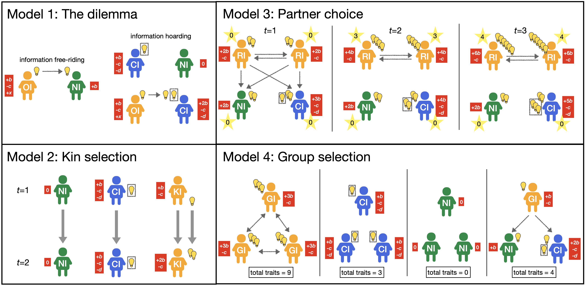

```

**Figure S1.** A schematic of the logic underlying the models. Agent types are denoted by colour and initials (OI = Open Innovator; NI = Non-Innovator; CI = Closed Innovator; KI = Kin-based Innovator; RI = Reputation-based Innovator; GI = Group Innovator); traits as lightbulbs, with lightbulbs enclosed in boxes denoting hoarded knowledge; costs and benefits in red boxes (see Table S1 for parameter definitions); information flows by grey arrows; and reputations in Model 3 in stars. Model 1 explores the basic dilemma of costly innovation. Information free-riding occurs when Open Innovators (OI; orange) produce knowledge at cost $c$ which benefits them $b$, while Non-Innovators (NI; green) copy that information and receive benefit $b$ but without paying any cost. Information hoarding occurs when Closed Innovators (CI; blue) produce knowledge that is protected from being copied by others; when interacting with OIs, CIs then have both their private knowledge (enclosed in a grey box) plus OI's shared public knowledge. In Model 2 (kin selection), strategies are passed from parents in $t=1$ to offspring in $t=2$. Lineages of Kin-based Innovators (KI; orange) also culturally transmit their traits, unlike lineages of NIs who have no traits to transmit, and CIs who protect their traits. In Model 4 (partner choice), agents have reputations for sharing shown in stars, and Reputation-based Innovators (RI; orange) share only with others who have the highest reputations. Initially, the lack of reputations causes the two RIs to share with every other agent. From $t=2$, RIs share only with each other, as they have higher reputations than both NIs and CIs who do not share. Eventually this results in RIs accumulating more traits than the other types. In Model 5 (group selection), Group Innovators (GI; orange) only share with other members of their group. Here there are three groups, one all GIs, one all CIs, one all NIs, and one mixed. Cultural group selection favours the group with the most number of traits, which here is the group of GIs. Within the mixed group, however, GIs do poorly relative to the other types.

\newpage

**Table S1.** Definitions of model parameters. Paramters are common to all models unless specified. ABMs = Agent-Based Models (Models 1b, 2, 3 and 4). All probabilities are denoted $p$, non-probabilities with other symbols.

```{r table S1 parameter values, echo=FALSE}

Parameter <- c("$c$", "$b$", "$d$", "$p_h$", "$x$", "$\\gamma$", "$N$", "$L$", "$p_i$", "$p_c$", "$p_s$", "$p_d$", "$n_c$", "$r_s$", "$r_i$", "$n$", "$g$", "$p_g$", "$k$", "$u$")
Definition <- c("The cost to an Open or Closed Innovator of innovation", 
                "The benefit of innovation to the innovator and, if released, to every other individual",
                "The cost to Closed Innovators of attempting to protect their innovation",
                "The probability of a Closed Innovator successfully protecting their innovation",
                "The unspecified benefit to individuals for releasing their innovation to others (Model 1 only)",
                "The proportion of open knowledge that $b$ increases by in each timestep (Model 1a only)",
                "The total number of agents in the population (ABMs only)",
                "The total number of learnable traits (ABMs only)",
                "The probability of innovation (ABMs only)",
                "The probability of copying a trait (ABMs only)",
                "The probability of payoff-biased copying of strategies (ABMs only)",
                "The probability of each agent in each timestep dying and being replaced with a new unknowledgable agent (ABMs only)",
                "The number of candidate learners from whom agents select the one with the highest reputation with whom to share (Model 3 only)",
                "The reputational increase from sharing any trait with another agent (Model 3 only)",
                "The reputational increase from sharing a trait that this agent has innovated with another agent (Model 3 only)",
                "The number of agents per group (Model 4 only)",
                "The number of groups (Model 4 only)",
                "The probability of intergroup conflict (Model 4 only)",
                "The fitness cost to the punishing Group Innovator agent per punished agent (Model 4 only)",
                "The fitness cost to the punished agent per punishing agent (Model 4 only)"
                )

tableData <- data.frame(Parameter, Definition)

```
`r knitr::kable(tableData)`

\newpage

```{r make fig S2, echo=FALSE, results = 'hide', eval = eval_chunks}

png("figures/figS2.png", height = 7, width = 10, units = "in", res = 300)

par(mfrow=c(1,2))

model1a_baryplot(b = 0.3, c = 0.15, x = 0.2, d = 0, p_h = 0, w_0 = 1, 
                panel_label = substitute(paste("(",italic("a"),")"))) # OI=CI
model1a_baryplot(b = 0.3, c = 0.15, x = 0.2, d = 0.01, p_h = 0, w_0 = 1, 
                panel_label = substitute(paste("(",italic("b"),")"))) # OI

dev.off()

```
```{r show fig S2 baryplots with ph 0, out.width="100%", echo=FALSE}

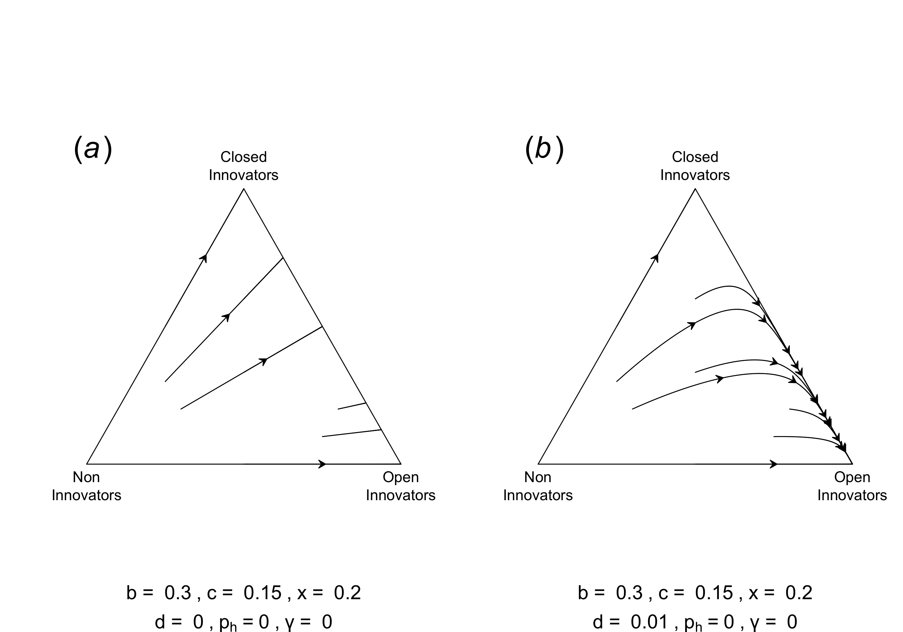

```

**Figure S2.** Reducing the probability of Closed Innovator agents successfully hoarding their knowledge ($p_h$) favours Open Innovators in Model 1a. (*a*) Setting $p_h = 0$, meaning that Closed Innovators can never protect their knowledge, makes it easier for Open Innovators to replace Closed Innovators, assuming $x > c$. When $d = 0$, Open Innovators and Closed Innovators have the same payoffs. (*b*) Increasing $d$ any amount with otherwise identical parameter values as in (*a*) favors Open Innovators.

\newpage

```{r make fig S3, echo=FALSE, results = 'hide', eval = eval_chunks}

# create folder called figures if it doesn't already exist
if (!dir.exists("figures")) {dir.create("figures")}

jpeg("figures/figS3.jpg", height = 3, width = 8, units = "in", res = 300)

par(mfrow=c(1,3))

figS3a <- model1b(N = 1000, t_max = 100, L = 1000,
                  x_0 = 1/3, y_0 = 1/3, r_max = 10,
                  p_c = 1, p_i = 1, p_h = 1, 
                  p_s = 0.1, p_d = 1,
                  b = 0.15, c = 0.1, d = 0.1, x = 0.05)

figS3b <- model1b(N = 1000, t_max = 100, L = 1000,
                  x_0 = 1/3, y_0 = 1/3, r_max = 10,
                  p_c = 1, p_i = 1, p_h = 1, 
                  p_s = 0.1, p_d = 1,
                  b = 0.2, c = 0.1, d = 0.05, x = 0.05)

figS3c <- model1b(N = 1000, t_max = 100, L = 1000,
                  x_0 = 1/3, y_0 = 1/3, r_max = 10,
                  p_c = 1, p_i = 1, p_h = 1, 
                  p_s = 0.1, p_d = 1,
                  b = 0.2, c = 0.1, d = 0.05, x = 0.2)

plot_freq(figS3a, 
          panel_label = substitute(paste("(",italic("a"),")")),
          main_title = bquote(atop("b = " ~ .(0.15) ~ "," ~ "c = " ~ .(0.1) ~ "," ~ "x = " ~ .(0.05), "d = " ~ .(0.1) ~ "," ~ p[h] ~ "=" ~ .(1))))
plot_freq(figS3b, draw_legend = F,
          panel_label = substitute(paste("(",italic("b"),")")),
          main_title = bquote(atop("b = " ~ .(0.2) ~ "," ~ "c = " ~ .(0.1) ~ "," ~ "x = " ~ .(0.05), "d = " ~ .(0.05) ~ "," ~ p[h] ~ "=" ~ .(1))))
plot_freq(figS3c, draw_legend = F,
          panel_label = substitute(paste("(",italic("c"),")")),
          main_title = bquote(atop("b = " ~ .(0.2) ~ "," ~ "c = " ~ .(0.1) ~ "," ~ "x = " ~ .(0.2), "d = " ~ .(0.05) ~ "," ~ p[h] ~ "=" ~ .(1))))

dev.off()

```

```{r show fig S3 abm versions of 3 baryplots, out.width="100%", echo=FALSE}

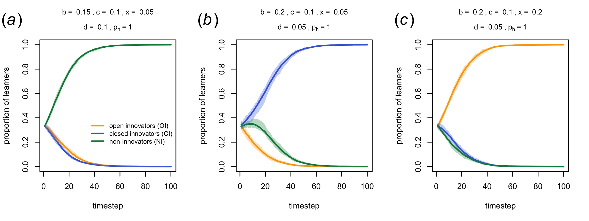

```

**Figure S3.** Time series from Model 1b for the same parameter values as shown in Figure 1 for Model 1a, which favour (a) Non-Innovators, (b) Closed Innovators, and (c) Open Innovators, respectively. To match Model 1a in all other respects, we assume perfect innovation ($p_i = 1$) and copying ($p_c = 1$), and non-overlapping timesteps ($p_d = 1$). This replicates and confirms the analytical Model 1a but within the agent-based modelling framework of Model 1b. (Other parameters: $N = 1000$, $L = 1000$, $p_s = 0.1$. Lines shown are means of 10 independent runs, with shaded areas showing the range across all runs.)


\newpage

```{r make fig S4, echo=FALSE, results = 'hide', eval = eval_chunks}

jpeg("figures/figS4.jpg", height = 3, width = 8, units = "in", res = 300)

par(mfrow=c(1,3))

figS4a <- model1b(N = 1000, t_max = 100, L = 1000,
                  x_0 = 1/3, y_0 = 1/3, r_max = 10,
                  p_c = 1, p_i = 1, p_h = 0, 
                  p_s = 0.1, p_d = 1,
                  b = 0.3, c = 0.15, d = 0, x = 0.2)

figS4b <- model1b(N = 1000, t_max = 100, L = 1000,
                  x_0 = 1/3, y_0 = 1/3, r_max = 10,
                  p_c = 1, p_i = 1, p_h = 0, 
                  p_s = 0.1, p_d = 1,
                  b = 0.3, c = 0.15, d = 0.01, x = 0.2)

figS4c <- model1b(N = 1000, t_max = 100, L = 1000,
                  x_0 = 1/3, y_0 = 1/3, r_max = 10,
                  p_c = 1, p_i = 1, p_h = 1, 
                  p_s = 0.1, p_d = 0,
                  b = 0.2, c = 0.1, d = 0.05, x = 0.2)

plot_freq(figS4a, 
          panel_label = substitute(paste("(",italic("a"),")")),
          main_title = bquote(atop("b = " ~ .(0.3) ~ "," ~ "c = " ~ .(0.15) ~ "," ~ "x = " ~ .(0.2), "d = " ~ .(0) ~ "," ~ p[h] ~ "=" ~ .(0) ~ "," ~ p[d] ~ "=" ~ .(1))))
plot_freq(figS4b, draw_legend = F,
          panel_label = substitute(paste("(",italic("b"),")")),
          main_title = bquote(atop("b = " ~ .(0.3) ~ "," ~ "c = " ~ .(0.15) ~ "," ~ "x = " ~ .(0.2), "d = " ~ .(0.01) ~ "," ~ p[h] ~ "=" ~ .(0) ~ "," ~ p[d] ~ "=" ~ .(1))))
plot_freq(figS4c, draw_legend = F,
          panel_label = substitute(paste("(",italic("c"),")")),
          main_title = bquote(atop("b = " ~ .(0.2) ~ "," ~ "c = " ~ .(0.1) ~ "," ~ "x = " ~ .(0.2), "d = " ~ .(0.05) ~ "," ~ p[h] ~ "=" ~ .(1) ~ "," ~ p[d] ~ "=" ~ .(0))))

dev.off()

```

```{r show fig S4 abm versions of ph0 and gamma1 baryplots, out.width="100%", echo=FALSE}

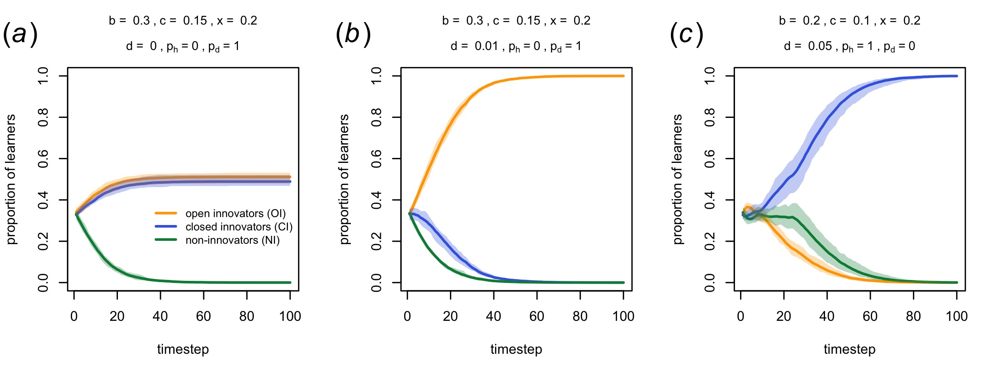

```

**Figure S4.** Time series from Model 1b for the same parameter values as shown in figure S2 and figure 2 for Model 1a, replicating the results for Model 1a using the agent-based Model 1b. (a) When Closed Innovators cannot hoard their information ($p_h = 0$), they co-exist with Open Innovators when hoarding is costless ($d = 0$), as in figure S2(a). (b) When hoarding is costly ($d > 0$), Open Innovators outperform Closed Innovators, as in figure S2(b). (c) When agents never die ($p_d = 0$), allowing the accumulation of knowledge over timesteps, then Closed Innovators who can hoard outperform other agents as they can accumulate private knowledge, as well as benefit from accumulated public knowledge generated by Open Innovators, as in figure 2. (Other parameters: $N = 1000$, $L = 1000$, $p_c = 1$, $p_i = 1$, $p_s = 0.1$. Lines shown are means of 10 independent runs, with shaded areas showing the range across all runs.)


\newpage

```{r make fig S5, echo=FALSE, results = 'hide', eval = eval_chunks}

# x and c heatmap
x_values <- seq(0.1,1,0.1)
c_values <- seq(0.1,1,0.1)
xc_heatdata <- matrix(NA, nrow = length(x_values), ncol = length(c_values))
rownames(xc_heatdata) <- x_values
colnames(xc_heatdata) <- c_values

for (i in 1:length(x_values)) {
  
  for (j in 1:length(c_values)) {
    
    cat("running x =", x_values[i], ", c =", c_values[j], fill=T)
    
    d <- model1b(N=100, t_max=200, b=0.1, x=x_values[i], c=c_values[j], d=0.05, p_h=1, p_d=1, p_s=0.1, r_max=1, p_i=1, p_c=1)
    mean_OI <- mean(d$OIfreq[d$t==max(d$t)])
    mean_CI <- mean(d$CIfreq[d$t==max(d$t)])
    mean_NI <- mean(d$NIfreq[d$t==max(d$t)])
    xc_heatdata[i,j] <- which.max(c(mean_OI,mean_CI,mean_NI))
    # 1=OI, 2=CI, 3=NI
  }
  
}

write.csv(xc_heatdata, "xc_heatdata.csv", row.names = F)
# xc_heatdata <- read.csv("xc_heatdata.csv")

# x and b heatmap
x_values <- seq(0.1,1,0.1)
b_values <- seq(0.1,1,0.1)
xb_heatdata <- matrix(NA, nrow = length(x_values), ncol = length(b_values))
rownames(xb_heatdata) <- x_values
colnames(xb_heatdata) <- b_values

for (i in 1:length(x_values)) {
  
  for (j in 1:length(b_values)) {
    
    cat("running x =", x_values[i], ", b =", b_values[j], fill=T)
    
    d <- model1b(N=100, t_max=200, b=b_values[j], x=x_values[i], c=0.05, d=0.05, p_h=1, p_d=1, p_s=0.1, r_max=1, p_i=1, p_c=1)
    mean_OI <- mean(d$OIfreq[d$t==max(d$t)])
    mean_CI <- mean(d$CIfreq[d$t==max(d$t)])
    mean_NI <- mean(d$NIfreq[d$t==max(d$t)])
    xb_heatdata[i,j] <- which.max(c(mean_OI,mean_CI,mean_NI))
    # 1=OI, 2=CI, 3=NI
  }
  
}

write.csv(xb_heatdata, "xb_heatdata.csv", row.names = F)
# xb_heatdata <- read.csv("xb_heatdata.csv")

# x and pd heatmap
x_values <- seq(0.1,1,0.1)
pd_values <- seq(0,1,0.1)
xpd_heatdata <- matrix(NA, nrow = length(x_values), ncol = length(pd_values))
rownames(xpd_heatdata) <- x_values
colnames(xpd_heatdata) <- pd_values

for (i in 1:length(x_values)) {
  
  for (j in 1:length(pd_values)) {
    
    cat("running x =", x_values[i], ", p_d =", pd_values[j], fill=T)
    
    d <- model1b(N=100, t_max=200, b=0.3, x=x_values[i], c=0.05, d=0.05, p_h=1, p_d=pd_values[j], p_s=0.1, r_max=1, p_i=1, p_c=1)
    mean_OI <- mean(d$OIfreq[d$t==max(d$t)])
    mean_CI <- mean(d$CIfreq[d$t==max(d$t)])
    mean_NI <- mean(d$NIfreq[d$t==max(d$t)])
    xpd_heatdata[i,j] <- which.max(c(mean_OI,mean_CI,mean_NI))
    # 1=OI, 2=CI, 3=NI
  }
  
}

write.csv(xpd_heatdata, "xpd_heatdata.csv", row.names = F)
# xpd_heatdata <- read.csv("xpd_heatdata.csv")

jpeg("figures/figS5a.jpg", height = 5, width = 5, units = "in", res = 600)
heatmap(xc_heatdata, 
        Rowv = NA, 
        Colv = NA, 
        col = c("orange", "royalblue", "springgreen4"),
        scale = "none",
        ylab = "benefit of sharing, x",
        xlab = "cost of innovation, c",
        add.expr = abline(a=0, b=1, lty = 2))
legend(x = 0.78, y = -0.15,
       legend = c("open innovators (OI)", 
                  "closed innovators (CI)", 
                  "non-innovators (NI)"),
       col = c("orange", "royalblue", "springgreen4"),
       lty = 0,
       pch = 15,
       pt.cex = 1.4,
       xpd = T,
       cex = 0.6)
dev.off()

jpeg("figures/figS5b.jpg", height = 5, width = 5, units = "in", res = 600)
heatmap(xb_heatdata, 
        Rowv = NA, 
        Colv = NA, 
        col = c("orange", "royalblue"), # for some reason value=2 becomes green of there are no 3s
        scale = "none",
        ylab = "benefit of sharing, x",
        xlab = "benefit of innovation, b",
        add.expr = abline(a=0, b=1, lty = 2))
legend(x = 0.78, y = -0.15,
       legend = c("open innovators (OI)", 
                  "closed innovators (CI)", 
                  "non-innovators (NI)"),
       col = c("orange", "royalblue", "springgreen4"),
       lty = 0,
       pch = 15,
       pt.cex = 1.4,
       xpd = T,
       cex = 0.6)
dev.off()

jpeg("figures/figS5c.jpg", height = 5, width = 5, units = "in", res = 600)
heatmap(xpd_heatdata, 
        Rowv = NA, 
        Colv = NA, 
        col = c("orange", "royalblue", "springgreen4"),
        scale = "none",
        ylab = "benefit of sharing, x",
        xlab = "probability of agent death, p_d")
legend(x = 0.78, y = -0.15,
       legend = c("open innovators (OI)", 
                  "closed innovators (CI)", 
                  "non-innovators (NI)"),
       col = c("orange", "royalblue", "springgreen4"),
       lty = 0,
       pch = 15,
       pt.cex = 1.4,
       xpd = T,
       cex = 0.6)
dev.off()

```

```{r show fig S5 xc xb and xpd heatmaps, out.width="100%", fig.align='center', echo=FALSE}

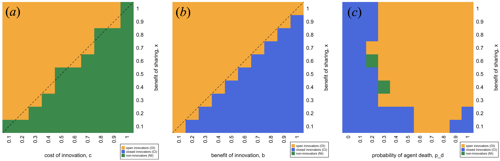

```
**Figure S5.** Heatmaps showing the most frequent strategy (Open Innovation, orange; Closed Innovation, blue; Non-Innovation, green) across different parameter values in the agent-based Model 1b. (*a*) Open Innovation is favoured over Non-Innovation when the benefit of sharing is greater than the cost of innovation (i.e. $x > c$), as predicted by the analytic model. (*b*) Open Innovation is favoured over Closed Innovation when the benefit of sharing is greater than the benefit of innovation (i.e. $x > b$), as predicted by the analytic model. (*c*) When timesteps overlap ($p_d << 1$), then Closed Innovators are favoured, as they can accumulate private beneficial knowledge.

\newpage

```{r make fig S6, echo=FALSE, results = 'hide', eval = eval_chunks}

# p_i and p_c heatmap
pi_values <- seq(0.1,1,0.1)
pc_values <- seq(0.1,1,0.1)
pipc_heatdata <- matrix(NA, nrow = length(pi_values), ncol = length(pc_values))
rownames(pipc_heatdata) <- pi_values
colnames(pipc_heatdata) <- pc_values

for (i in 1:length(pi_values)) {
  
  for (j in 1:length(pc_values)) {
    
    cat("running p_i =", pi_values[i], ", p_c =", pc_values[i], fill=T)
    
    d <- model1b(N=100, t_max=200, b=0.2, c=0.1, x=0.1, d=0.05, p_h=1, p_d=1, p_s=0.1, r_max=10,
                 p_i=pi_values[i], p_c=pc_values[j])
    mean_OI <- mean(d$OIfreq[d$t==max(d$t)])
    mean_CI <- mean(d$CIfreq[d$t==max(d$t)])
    mean_NI <- mean(d$NIfreq[d$t==max(d$t)])
    pipc_heatdata[i,j] <- which.max(c(mean_OI,mean_CI,mean_NI))
    # 1=OI, 2=CI, 3=NI
  }
  
}

write.csv(pipc_heatdata, "pipc_heatdata.csv", row.names = F)
# pipc_heatdata <- read.csv("pipc_heatdata.csv")

jpeg("figures/figS6.jpg", height = 6, width = 6, units = "in", res = 600)

par(mfrow=c(1,1))

heatmap(pipc_heatdata, 
        Rowv = NA, 
        Colv = NA, 
        col = c("orange", "royalblue", "springgreen4"),
        scale = "none",
        ylab = expression("prob of innovation, p"["i"]),
        xlab = expression("prob of copying, p"["c"]))
legend(x = 0.82, y = -0.12,
       legend = c("open innovators (OI)", 
                  "closed innovators (CI)", 
                  "non-innovators (NI)"),
       col = c("orange", "royalblue", "springgreen4"),
       lty = 0,
       pch = 15,
       pt.cex = 1.4,
       xpd = T,
       cex = 0.6)

dev.off()

```

```{r show fig S6 pipc heatmap, out.width="50%", fig.align='center', echo=FALSE}

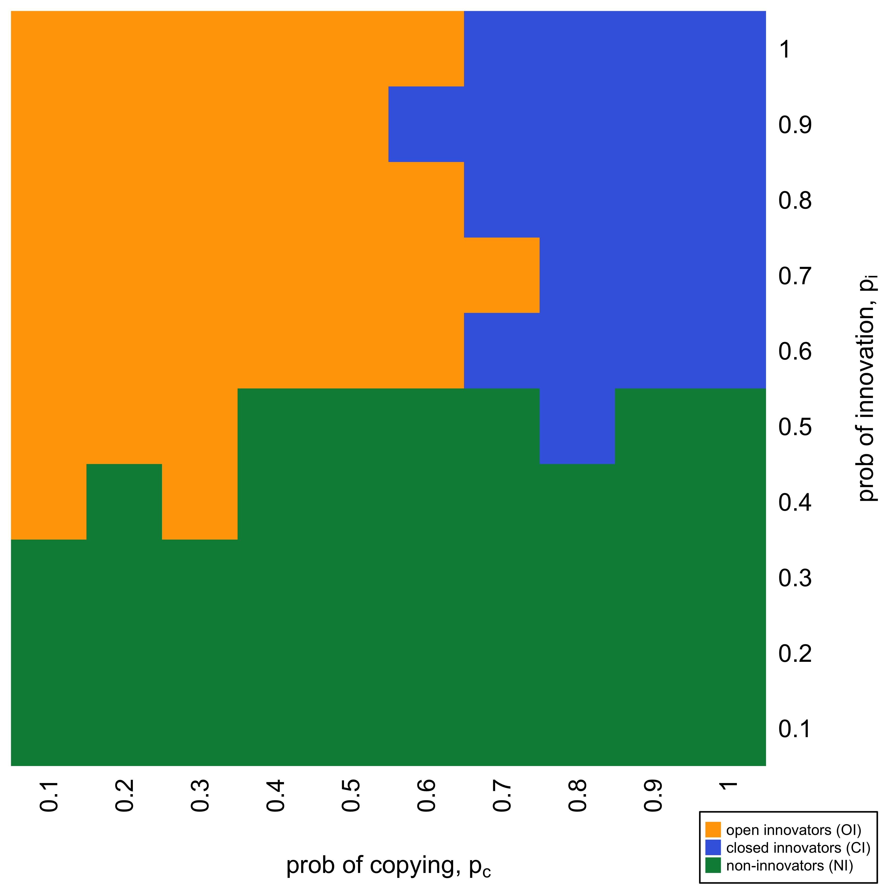

```

**Figure S6.** Heatmap showing the most frequent strategy (Open Innovation, orange; Closed Innovation, blue; Non-Innovation, green) across different probabilities of successful innovation $p_i$ and different probabilities of copying traits when shared $p_c$, for Model 1b. When the probability of innovation $p_i$ is low, Non-Innovators perform better given that Open Innovators and Closed Innovators both bear a cost for innovation that it increasingly likely to yield no benefits. When the probability of innovation $p_i$ is high and the probability of copying $p_c$ is high, then Closed Innovators do well because they can easily copy beneficial traits innovated by Open Innovators, as well as keep their own privately innovated traits. When the probability of innovation $p_i$ is high and the probability of copying $p_c$ is low, then Open Innovators do well because most knowledge is now private but they do not bear the cost of hoarding that Closed Innovators do. However, when $p_c$ is lower than $p_i$ then the information dilemma does not apply, as individual learning is effectively less costly than social learning. Other parameter values: $b = 0.2$, $c=0.1$, $x=0.1$, $d=0.05$, $p_h=1$, $p_d=1$, $p_s=0.1$, $t_{max} = 200$, $N = 100$, results are means of 10 independent runs.


\newpage

```{r make fig S7, echo=FALSE, results = 'hide', eval = eval_chunks}

# create folder called figures if it doesn't already exist
if (!dir.exists("figures")) {dir.create("figures")}

jpeg("figures/figS7.jpg", height = 6, width = 8, units = "in", res = 300)

par(mfrow=c(2,3))

figS7a <- model1b(N = 1000, t_max = 100, L = 1000,
                  x_0 = 1/3, y_0 = 1/3, r_max = 1,
                  p_c = 1, p_i = 1, p_h = 1, 
                  p_s = 0.1, p_d = 1,
                  b = 0.15, c = 0.1, d = 0.1, x = 0.05)

figS7b <- model1b(N = 1000, t_max = 100, L = 1000,
                  x_0 = 1/3, y_0 = 1/3, r_max = 1,
                  p_c = 1, p_i = 1, p_h = 1, 
                  p_s = 0.1, p_d = 1,
                  b = 0.2, c = 0.1, d = 0.05, x = 0.05)

figS7c <- model1b(N = 1000, t_max = 100, L = 1000,
                  x_0 = 1/3, y_0 = 1/3, r_max = 1,
                  p_c = 1, p_i = 1, p_h = 1, 
                  p_s = 0.1, p_d = 1,
                  b = 0.2, c = 0.1, d = 0.05, x = 0.2)

figS7d <- model1b(N = 100, t_max = 100, L = 1000,
                  x_0 = 1/3, y_0 = 1/3, r_max = 1,
                  p_c = 1, p_i = 1, p_h = 1, 
                  p_s = 0.1, p_d = 0.75,
                  b = 0.2, c = 0.1, d = 0.05, x = 0.2)

# bar chart showing final absolute number of traits in S7a-S7d
figS7e <- rep(NA, 4)

d <- model1b(N = 1000, t_max = 100, L = 1000,
             x_0 = 1/3, y_0 = 1/3, r_max = 10,
             p_c = 1, p_i = 1, p_h = 1, 
             p_s = 0.1, p_d = 1,
             b = 0.15, c = 0.1, d = 0.1, x = 0.05)
figS7e[1] <- mean(d$mean_traits_abs[d$t == max(d$t)])

d <- model1b(N = 1000, t_max = 100, L = 1000,
             x_0 = 1/3, y_0 = 1/3, r_max = 10,
             p_c = 1, p_i = 1, p_h = 1, 
             p_s = 0.1, p_d = 1,
             b = 0.2, c = 0.1, d = 0.05, x = 0.05)
figS7e[2] <- mean(d$mean_traits_abs[d$t == max(d$t)])

d <- model1b(N = 1000, t_max = 100, L = 1000,
             x_0 = 1/3, y_0 = 1/3, r_max = 10,
             p_c = 1, p_i = 1, p_h = 1, 
             p_s = 0.1, p_d = 1,
             b = 0.2, c = 0.1, d = 0.05, x = 0.2)
figS7e[3] <- mean(d$mean_traits_abs[d$t == max(d$t)])

d <- model1b(N = 100, t_max = 100, L = 1000,
             x_0 = 1/3, y_0 = 1/3, r_max = 10,
             p_c = 1, p_i = 1, p_h = 1, 
             p_s = 0.1, p_d = 0.75,
             b = 0.2, c = 0.1, d = 0.05, x = 0.2)
figS7e[4] <- mean(d$mean_traits_abs[d$t == max(d$t)])

plot_freq(figS7a, 
          panel_label = substitute(paste("(",italic("a"),")")),
          main_title = bquote(atop("b = " ~ .(0.15) ~ "," ~ "c = " ~ .(0.1) ~ "," ~ "x = " ~ .(0.05), "d = " ~ .(0.1) ~ "," ~ p[h] ~ "=" ~ .(1) ~ "," ~ p[d] ~ "=" ~ .(1))))
plot_freq(figS7b, draw_legend = F,
          panel_label = substitute(paste("(",italic("b"),")")),
          main_title = bquote(atop("b = " ~ .(0.2) ~ "," ~ "c = " ~ .(0.1) ~ "," ~ "x = " ~ .(0.05), "d = " ~ .(0.05) ~ "," ~ p[h] ~ "=" ~ .(1) ~ "," ~ p[d] ~ "=" ~ .(1))))
plot_freq(figS7c, draw_legend = F,
          panel_label = substitute(paste("(",italic("c"),")")),
          main_title = bquote(atop("b = " ~ .(0.2) ~ "," ~ "c = " ~ .(0.1) ~ "," ~ "x = " ~ .(0.2), "d = " ~ .(0.05) ~ "," ~ p[h] ~ "=" ~ .(1) ~ "," ~ p[d] ~ "=" ~ .(1))))
plot_freq(figS7d, draw_legend = F,
          panel_label = substitute(paste("(",italic("d"),")")),
          main_title = bquote(atop("b = " ~ .(0.2) ~ "," ~ "c = " ~ .(0.1) ~ "," ~ "x = " ~ .(0.2), "d = " ~ .(0.05) ~ "," ~ p[h] ~ "=" ~ .(1) ~ "," ~ p[d] ~ "=" ~ .(0.75))))

barplot(figS7e,
        ylab = "mean number of final traits",
        names.arg = c("a","b","c","d"),
        ylim = c(0,max(figS7e)+100))
text(0.75,figS7e[1]+100,round(figS7e[1]), cex = 1)
text(1.9,figS7e[2]+100,round(figS7e[2]), cex = 1)
text(3.1,figS7e[3]+100,round(figS7e[3]), cex = 1)
text(4.3,figS7e[4]+100,round(figS7e[4]), cex = 1, xpd=T)
text(-1, max(figS7e)+450, labels = substitute(paste("(",italic("e"),")")), cex = 2, xpd = NA)

dev.off()

```

```{r show fig S7 cce versions, out.width="100%", echo=FALSE}

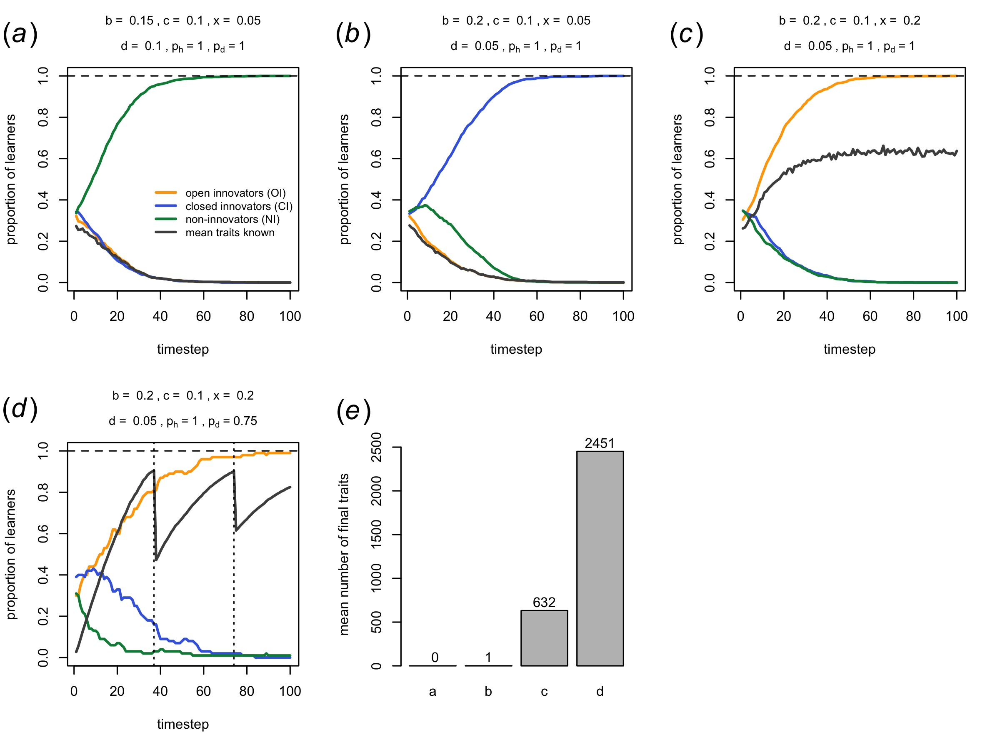

```

**Figure S7.** Open Innovation favours the accumulation of cultural traits in Model 1b, especially when there are overlapping timesteps. (a-c) show the equivalent panels from figure S3 with non-overlapping timesteps, for a single run, and with the mean proportion of the $L$ traits learned by all agents shown in dark grey. (a) When Non-Innovators dominate, then the mean proportion of traits known drops to zero given that Non-Innovators do not innovate, and no traits are passed down generations. (b) When Closed Innovators dominate, then the mean proportion of traits known drops to one, given that in each timestep Closed Innovators discover one new trait (because $p_i=1$) which is not shared within a generation nor passed to subsequent generations. (c) When Open Innovators dominate, then the mean proportion of traits known stabilises at around 0.6. This is because Open Innovators innovate and share their traits with all other agents in their generation, but these are wiped in the next timestep so the next generation starts from scratch. A single generation only learns 60% rather than 100% of the $L$ traits even though $p_i=p_c=1$ because some agents innovate the same traits as other agents, so not all $L$ traits are available to share. (d) When timesteps overlap, traits can accumulate over time in an open-ended fashion. Here, vertical dotted lines indicate instances when 90% of all $L$ traits are known and another $L$ traits are added to the trait space. This allows continual accumulation of traits amongst the Open Innovators. (e) The mean absolute number of traits known in the final timestep of the scenarios depicted in panels a-d of this figure, averaged across 10 independent runs. Numbers above bars show the mean value depicted in the bar.


\newpage

```{r make fig S8, echo=FALSE, results = 'hide', eval = eval_chunks}

# fig S8a: Model 2b, KI still favoured
figS8a <- model2(t_max=100, N=1000, r_max=10, b=0.15, c=0.1, d=0.1, model_version = "b")
plot_freqKI(figS8a)

# fig S8b: Model 2c, KI and NI coexist
figS8b <- model2(t_max=100, N=1000, r_max=10, b=0.15, c=0.1, d=0.1, model_version = "c")
plot_freqKI(figS8b)

# fig S8c: bar chart with all 3 versions of Model 2
figS8c <- matrix(NA, 2, 3)
rownames(figS8c) <- c("Model 2b","Model 2c")
colnames(figS8c) <- c("p_c = 1", "p_c = 0.9", "p_c = 0.8")

d <- model2(N = 100, t_max = 100, L = 1000,
            x_0 = 1, y_0 = 0, r_max = 10,
            p_c = 1, p_i = 1, p_h = 1, p_s = 0.1,
            b = 0.2, c = 0.1, d = 0.1,
            model_version = "b")
figS8c[1,1] <- mean(d$mean_traits_abs[d$t == max(d$t)])

d <- model2(N = 100, t_max = 100, L = 1000,
            x_0 = 1, y_0 = 0, r_max = 10,
            p_c = 1, p_i = 1, p_h = 1, p_s = 0.1,
            b = 0.2, c = 0.1, d = 0.1,
            model_version = "c")
figS8c[2,1] <- mean(d$mean_traits_abs[d$t == max(d$t)])

d <- model2(N = 100, t_max = 100, L = 1000,
            x_0 = 1, y_0 = 0, r_max = 10,
            p_c = 0.9, p_i = 1, p_h = 1, p_s = 0.1,
            b = 0.2, c = 0.1, d = 0.1,
            model_version = "b")
figS8c[1,2] <- mean(d$mean_traits_abs[d$t == max(d$t)])

d <- model2(N = 100, t_max = 100, L = 1000,
            x_0 = 1, y_0 = 0, r_max = 10,
            p_c = 0.9, p_i = 1, p_h = 1, p_s = 0.1,
            b = 0.2, c = 0.1, d = 0.1,
            model_version = "c")
figS8c[2,2] <- mean(d$mean_traits_abs[d$t == max(d$t)])

d <- model2(N = 100, t_max = 100, L = 1000,
            x_0 = 1, y_0 = 0, r_max = 10,
            p_c = 0.8, p_i = 1, p_h = 1, p_s = 0.1,
            b = 0.2, c = 0.1, d = 0.1,
            model_version = "b")
figS8c[1,3] <- mean(d$mean_traits_abs[d$t == max(d$t)])

d <- model2(N = 100, t_max = 100, L = 1000,
            x_0 = 1, y_0 = 0, r_max = 10,
            p_c = 0.8, p_i = 1, p_h = 1, p_s = 0.1,
            b = 0.2, c = 0.1, d = 0.1,
            model_version = "c")
figS8c[2,3] <- mean(d$mean_traits_abs[d$t == max(d$t)])

# create folder called figures if it doesn't already exist
if (!dir.exists("figures")) {dir.create("figures")}

jpeg("figures/figS8.jpg", height = 3, width = 8, units = "in", res = 300)

par(mfrow=c(1,3))

plot_freqKI(figS8a, draw_legend = T, main_title = "Model 2b", main_title_size = 1.3,
          panel_label = substitute(paste("(",italic("a"),")")))
plot_freqKI(figS8b, draw_legend = F, main_title = "Model 2c", main_title_size = 1.3,
            panel_label = substitute(paste("(",italic("b"),")")))
barplot(figS8c, beside=T, legend.text=F, 
        col=c("black", "lightgrey"),
        ylab="log(mean final traits)",
        xlab = "trait copying fidelity",
        names.arg = c(expression('p'[c]*" = 1"),
                      expression('p'[c]*" = 0.9"),
                      expression('p'[c]*" = 0.8")),
        log = "y")
legend(0.5, 12000, legend = c("sexual rep / uniparental (Model 2b)","sexual rep / biparental (Model 2c)"), col = c("black","lightgrey"), pch = 15, pt.cex = 1.4, xpd = T)
text(-1, max(figS8c)+4000, labels = substitute(paste("(",italic("c"),")")), cex = 2, xpd = NA)

dev.off()

```

```{r show fig S8 models 2b and 2c, out.width="100%", echo=FALSE}

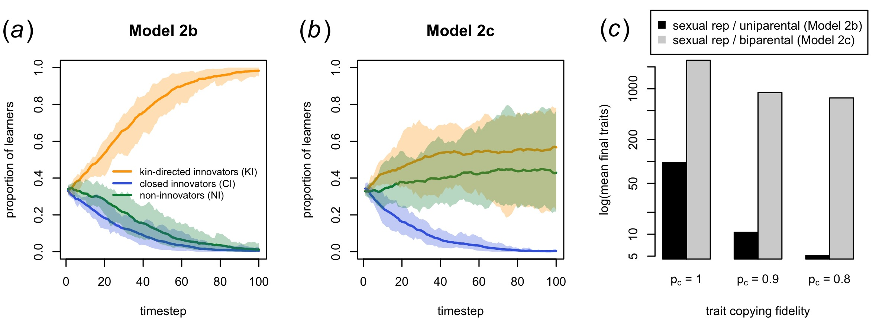

```

**Figure S8.** Two extensions of the asexual reproduction kin selection Model 2 reported in the main text, both featuring sexual reproduction. During the social learning phase, each agent picks two other agents at random as potential mates. With probability $p_s$, they select the potential mate with the higher fitness to be their actual mate, otherwise they pick one of the two at random. This mate selection via $p_s$ replaces payoff-biased copying of strategies. Each pair then produces one offspring (agents can appear in more than one mating pair, so the number of agents remains $N$). The offspring inherits the strategy of one randomly chosen parent. In Model 2b there is uniparental vertical transmission of traits such that the offspring copies all of the traits of the same parent from whom they inherited their strategy with probability $p_c$ per trait, unless the parent is a hoarder in which case no copying occurs. Model 2c is identical to Model 2b except that traits are learned additively from both non-hoarding parents. Offspring acquire every trait known by either parent with probability $p_c$ per trait. For example, if one parent has trait string 0100101 and the other parent has 1001001, the offspring will attempt to learn each of the five traits known by either parent (the 1s in the combined string 1101101) with probability $p_c$ per trait. Strategies are still inherited from a single randomly chosen parent, as these discrete traits cannot be combined or merged. Results: (*a*) Time series for Model 2b with sexual reproduction of agents but uniparental transmission of traits, favouring Kin-directed Innovators as in Model 2 (see figure 3*b*). (*b*) Time series for Model 2c with sexual reproduction of agents and biparental (blending) transmission of traits, now showing co-existence of Kin-directed Innovators and Non-Innovators. (*c*) With populations entirely composed of Kin-directed Innovators, biparental transmission (Model 2c) supports more traits at timestep $t = 100$ than does uniparental transmission (Model 2b), and is less vulnerable to copying error, much like horizontal transmission shown in figure 3(*c*).

\newpage

```{r make fig S9, echo=FALSE, results = 'hide', eval = eval_chunks}

output <- model3(n_c=199, N = 200, eq_stop = F, t_max = 100, L=200, p_d = 1/200, r_max = 10)

jpeg("figures/figS9.jpg", height = 4.5, width = 6, units = "in", res = 300)
plot_freqRI(output)
dev.off()

```

```{r show fig S9 time series model 3, out.width="100%", echo=FALSE}

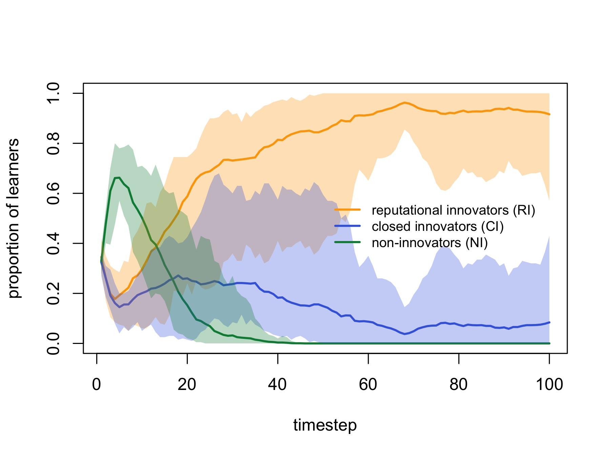

```
**Figure S9.** Time dynamics for Model 3 (partner choice) where Reputational Innovators are favoured due to strong partner choice ($n_c = N - 1$), and when reputations are global and increase when any traits are shared ($r_s = 1$, $r_i = 0$). Solid lines show means of 10 independent runs, with shading showing the range across runs. Initially, Non-Innovators do better than Reputational Innovators and increase in frequency due to their increasing reputations for sharing others' traits plus not paying any cost of innovation. However, once Non-Innovators reach a high enough frequency, few new traits are being innovated, and every agent comes to know every known trait. Non-Innovators therefore no longer gain reputation increases because there is nothing new to share. At this point Reputational Innovators have an advantage by innovating new traits and getting a reputation increase from sharing those new traits. Reputational Innovators start to accumulate higher reputations and gradually spread. Parameters: $n_c = 199$, $N = 200$, otherwise as in figure 4.

\newpage

```{r make fig S10, echo=FALSE, results = 'hide', eval = eval_chunks}

# create folder called figures if it doesn't already exist
if (!dir.exists("figures")) {dir.create("figures")}

p_g_values = seq(0,0.4,0.04)
p_m_values = seq(0,0.1,0.01)
r_max = 20
t_max = 1000

pg_pm_heatmap <- data.frame(p_m = rep(p_m_values, length(p_g_values)),
                           p_g = rep(p_g_values, each = length(p_m_values)),
                           GIfreq = rep(0, length(p_g_values)*length(p_m_values)))

counter <- 0

for (p_g in p_g_values) {
  
  for (p_m in p_m_values) {
    
    counter <- counter + 1
    cat("running p_g =", p_g, ", p_m =", p_m, "(", counter, "of", nrow(pg_pm_heatmap), ")", fill=T)
    
    output <- model4(p_g = p_g, p_m = p_m, r_max = r_max,
                     k = 0.2, u = 0.4,
                     t_max = t_max, eq_stop = T, progress = F)
    
    for(i in 1:r_max) pg_pm_heatmap$GIfreq[pg_pm_heatmap$p_m == p_m & pg_pm_heatmap$p_g == p_g] <- 
      pg_pm_heatmap$GIfreq[pg_pm_heatmap$p_m == p_m & pg_pm_heatmap$p_g == p_g] + 
      output$GIfreq[output$r == i & output$t == length(na.omit(output$GIfreq[output$r == i]))]
    
    write.csv(pg_pm_heatmap, "pg_pm_heatmap.csv", row.names = F)
    
  }
  
}

#pg_pm_heatmap <- read.csv("pg_pm_heatmap.csv")

pg_pm_heatmap$GIfreq <- pg_pm_heatmap$GIfreq / r_max

# convert to matrix
heatmap_matrix <- matrix(pg_pm_heatmap$GIfreq, nrow = length(unique(pg_pm_heatmap$p_m)), ncol = length(unique(pg_pm_heatmap$p_g)), dimnames = list(unique(pg_pm_heatmap$p_m), unique(pg_pm_heatmap$p_g)))

# define color palette
cols <- colorRampPalette(colors = c("grey33","orange"))

# make and save the heatmap
jpeg("figures/figS10.jpg", height = 4.5, width = 6, units = "in", res = 600)
heatmap(heatmap_matrix, 
        Rowv = NA, 
        Colv = NA, 
        col = cols(3),
        scale = "none",
        ylab = expression("probability of migration, p"["m"]),
        xlab = expression("probability of intergroup conflict, p"["g"]))
dev.off()


```

```{r show fig S10 heatmap pg pm model 4, echo=FALSE, out.width="100%"}

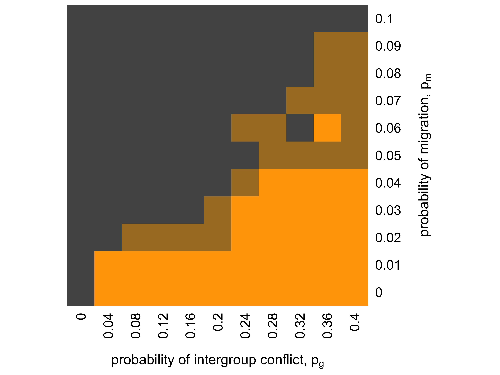

```
**Figure S10.** The frequency at equilibrium of Group Innovators in Model 4 (cultural group selection), for different values of the probability of intergroup conflict $p_g$, and the probability of migration between groups $p_m$. Colours indicate the mean frequency at equilibrium of Group Innovators across 20 independent simulation runs; orange = frequency greater than 2/3, black = frequency < 1/3, grey = intermediate frequencies. Other parameter values: $n = 50$, $g = 20$, $L = 1000$, $p_c = 0.8$, $p_i = 0.2$, $p_h = 0.9$, $p_s = 0.2$, $p_d = 0.1$, $b = 0.2$, $c = 0.1$, $d = 0.05$, $k = 0.2$, $u = 0.4$.


\newpage

```{r make fig S11, echo=FALSE, results = 'hide', eval = eval_chunks}

# create folder called figures if it doesn't already exist
if (!dir.exists("figures")) {dir.create("figures")}

g_values = seq(4,32,4)
n_values = seq(4,32,4)
r_max = 20
t_max = 1000

g_n_heatmap <- data.frame(n = rep(n_values, length(g_values)),
                           g = rep(g_values, each = length(n_values)),
                           GIfreq = rep(0, length(g_values)*length(n_values)))

counter <- 0

for (g in g_values) {
  
  for (n in n_values) {
    
    counter <- counter + 1
    cat("running g =", g, ", n =", n, "(", counter, "of", nrow(g_n_heatmap), ")", fill=T)
    
    output <- model4(g = g, n = n, r_max = r_max,
                     u = 0.1, p_g = 0.1,
                     t_max = t_max, eq_stop = T, progress = F)
    
    for(i in 1:r_max) g_n_heatmap$GIfreq[g_n_heatmap$n == n & g_n_heatmap$g == g] <- 
      g_n_heatmap$GIfreq[g_n_heatmap$n == n & g_n_heatmap$g == g] + 
      output$GIfreq[output$r == i & output$t == length(na.omit(output$GIfreq[output$r == i]))]
    
    write.csv(g_n_heatmap, "g_n_heatmap.csv", row.names = F)
    
  }
  
}

#g_n_heatmap <- read.csv("g_n_heatmap.csv")

g_n_heatmap$GIfreq <- g_n_heatmap$GIfreq / r_max

# convert to matrix
heatmap_matrix <- matrix(g_n_heatmap$GIfreq, nrow = length(unique(g_n_heatmap$n)), ncol = length(unique(g_n_heatmap$g)), dimnames = list(unique(g_n_heatmap$n), unique(g_n_heatmap$g)))

# define color palette
cols <- colorRampPalette(colors = c("grey33","orange"))

# make and save the heatmap
jpeg("figures/figS11.jpg", height = 4.5, width = 6, units = "in", res = 600)
heatmap(heatmap_matrix, 
        Rowv = NA, 
        Colv = NA, 
        col = cols(3),
        scale = "none",
        ylab = "group size, n",
        xlab = "number of groups, g")
dev.off()


```

```{r show fig S11 heatmap g n model 4, echo=FALSE, out.width="100%"}

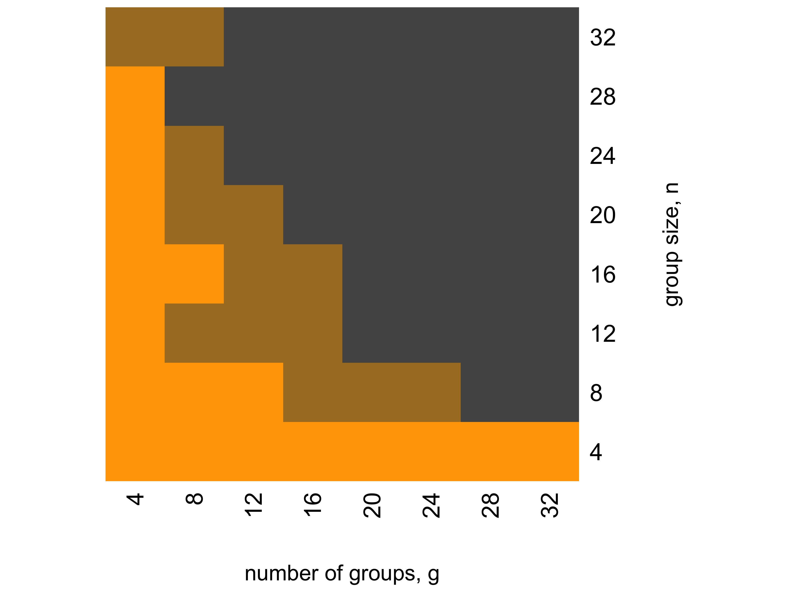

```
**Figure S11.** The frequency at equilibrium of Group Innovators in Model 4 (cultural group selection), for different numbers of groups $g$ and different group sizes $n$. Colours indicate the mean frequency at equilibrium of  Group Innovators across 20 independent simulation runs; orange = frequency greater than 2/3, black = frequency < 1/3, grey = intermediate frequencies. Other parameter values: $L = 1000$, $p_c = 0.8$, $p_i = 0.2$, $p_h = 0.9$, $p_s = 0.2$, $p_d = 0.1$, $p_m = 0.01$, $b = 0.2$, $c = 0.1$, $d = 0.05$, $k = 0.2$, $u = 0.4$.

